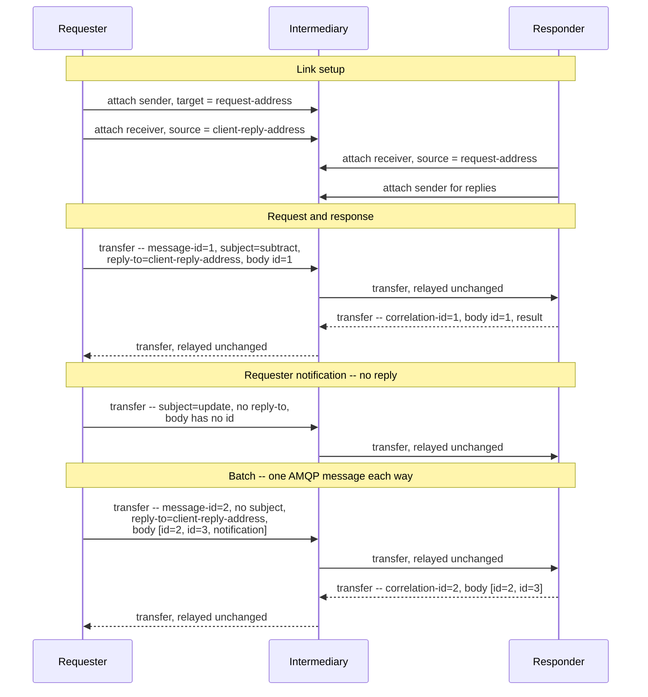

# JSON-RPC 2.0 over AMQP 1.0 -- Binding Specification

## Working Draft

> **Status of this document.** This is an early working draft prepared for discussion with the OASIS
> AMQP Technical Committee. It is incomplete: it sketches the core of a binding; detail arrives over
> later revisions. It is not for publication or implementation.
>
> **Revision.** 2026-08-24. Revisions are listed in Appendix C, one line each, and the commit
> history of this file carries the detail. Working Draft numbering is reserved for drafts submitted
> for public review.

## 1  Introduction

JSON-RPC 2.0 [JSON-RPC] is a stateless remote procedure call protocol. It defines request, response,
and notification objects, a batch form, its own correlation identifier, and its own error taxonomy.

JSON-RPC carried through an intermediary is already common, and each deployment solves the same set
of problems for itself. This document defines a binding of JSON-RPC 2.0 onto AMQP 1.0 [AMQP-v1.0]
that solves that set once, so implementations that conform to this binding interoperate.

It is not in scope for this specification to define how a requester and a responder manage link
credit, what address forms they use beyond the citation in §5, or any security mechanism beyond the
SASL and TLS mechanisms AMQP already provides. Settlement policy is left to the peers, with §6
supplying `message-id` as a deduplication key. It does not define how a requester learns that a
request went unanswered, or how long it waits before concluding one will not arrive; Appendix B
records both as open.

### 1.1  Normative References

- **[AMQP-v1.0]** *OASIS Advanced Message Queuing Protocol (AMQP) Version 1.0*. OASIS Standard, 29
  October 2012.
- **[AMQP-ADDR]** *AMQP Addressing Version 1.0*. Committee Specification Draft 01, 17 March 2021.
  https://docs.oasis-open.org/amqp/addressing/v1.0/csd01/addressing-v1.0-csd01.html
- **[JSON-RPC]** *JSON-RPC 2.0 Specification*, 2010-03-26, revised 2013-01-04.
  https://www.jsonrpc.org/specification
- **[RFC8259]** *The JavaScript Object Notation (JSON) Data Interchange Format*. IETF RFC 8259,
  December 2017.

### 1.2  Non-Normative References

- **[MCP-AMQP]** *MCP over AMQP 1.0 -- Binding Specification*. OASIS AMQP Technical Committee,
  working draft.

## 2  Definitions

- **JSON-RPC message** -- Any one of the four things [JSON-RPC] puts on the wire: a request object,
  a notification, a response object, or a batch of any of these.
- **Requester** -- The container that sends a request or a notification. The Client of [JSON-RPC].
- **Responder** -- The container that answers a request. The Server of [JSON-RPC]. A container may
  be a requester for some requests and a responder for others; the roles attach to a request, not
  to a container.
- **Request link** -- An AMQP link carrying requester-to-responder traffic: requests and
  notifications.
- **Reply link** -- An AMQP link carrying responder-to-requester traffic: responses, and any further
  messages an application protocol sends in answer to a request.
- **Request address** -- The AMQP address at which a responder receives requests and notifications.
- **Reply address** -- The AMQP address to which a responder sends what answers a request.

## 3  Overview

JSON-RPC traffic runs in two directions. Requests and notifications from the requester travel on a
request link to the responder. Responses and notifications from the responder travel on a reply
link to the requester. One JSON-RPC message maps to exactly one AMQP message, including batches. The
contract that correlates a request with what answers it travels in AMQP `properties` on each message
(§4.2). One reply address serves however many requests a requester has in flight, and the same two
links serve a requester attached directly to a responder and one attached to an intermediary where
many requesters share a request address (§5).

## 4  Message Mapping

### 4.1  Body

One JSON-RPC message maps to exactly one AMQP message. The JSON-RPC object, or array in the case of
a batch, is carried unchanged in a single `data` section with `content-type` set to
`application/json`, and the body remains authoritative for method dispatch and correlation.

The binding carries the JSON text octet for octet as [JSON-RPC] and [RFC8259] define it. Every field
the binding adds lives in an AMQP section.

### 4.2  Properties

This binding requires the request/response contract to be stated as AMQP `properties` fields, which
intermediaries relay without interpreting:

| Field | Usage |
|-------|-------|
| `message-id` | MUST be set on every message, to a globally unique value the requester has not used before. |
| `reply-to` | MUST be set on every request, to the reply address to which the responder sends what answers the request. MUST NOT be set on a notification. |
| `correlation-id` | MUST be set on every message a responder sends in answer to a request, to the value of that request's `message-id` as received, unaltered in type or representation. Absent on requests and notifications. A response whose request `id` could not be determined carries `id: null` in the body and still correlates here. |
| `subject` | The JSON-RPC `method` name of the message it accompanies. Where set, it MUST equal the method defined in the body, so an intermediary MAY route and filter on it. |
| `content-type` | `application/json;charset=utf-8` |

A responder cannot recover a request's `message-id` or `reply-to` from what it sends, so it MUST
retain both for as long as it may still send a message in answer to that request. It MUST take the
`correlation-id` and the destination of each such message from what it retained. The association
lives only in these retained values: a notification a responder sends in answer to a request carries
no body `id` (§4.3), and a body `id` is unique only within one requester's session, so it cannot
identify a request among requesters that share a request address (§5).

A requester reads whether a message completes a request from the body, since this binding adds no
AMQP field for terminality. Where an application protocol answers one request with several messages,
a response carries `result` or `error` and the request's `id`, while an intermediate notification
carries `method` and no `id`.

### 4.3  Notifications

A notification is a request object without an `id` member, and [JSON-RPC] states that a server MUST
NOT reply to one, including one inside a batch. A responder MUST NOT send any message in answer to a
notification; the absent body `id` marks it, consistent with the body remaining authoritative
(§4.1). A responder that cannot process a notification stays silent, since [JSON-RPC] defines no
response for one.

An application protocol may define notifications a responder sends to a requester. Those travel on
the reply link to the reply address of the request they relate to, carrying `correlation-id` per
§4.2. A notification relating to no request reaches the requester only through a reply address the
application protocol arranges, and the protocol defines how the requester supplies it.

### 4.4  Batches

[JSON-RPC] §6 lets a requester send an Array of request objects and have the responder return an
Array of the corresponding response objects. A batch is one JSON-RPC message, so it is one AMQP
message: the Array is the body, and `message-id` and `reply-to` are set as for a single request. The
response Array likewise travels as one AMQP message carrying `correlation-id`. Splitting a batch
across AMQP messages would lose the grouping [JSON-RPC] defines it to have.

`subject` is absent on a batch, which has no single method, so an intermediary routing on `subject`
cannot route one; a requester that needs such routing sends its requests individually.

Where every member of a batch is a notification, [JSON-RPC] forbids an empty Array in reply: the
responder sends no AMQP message and the requester MUST NOT wait for one, and such a batch is a
notification for the purposes of §4.3. Where the batch is an Array with no members, [JSON-RPC]
requires a single response object, which travels as one AMQP message carrying `correlation-id`.
Where a batch mixes requests and notifications, the response Array holds an entry per request and
none per notification, still as one AMQP message.

### 4.5  Errors

A request whose body is not valid JSON draws the single parse-error response [JSON-RPC] defines,
carried as one AMQP message with `correlation-id` set from the request's `message-id` and sent to
its `reply-to`. An unparseable request that carried neither gives the responder nothing to correlate
or address a response with, so it settles the delivery and sends nothing.

A message larger than the `max-message-size` the peer declared at attach cannot be sent. The layer
that assembled a batch MAY instead issue its members as individual messages, each its own AMQP
message under its own `message-id`, since splitting the batch itself would lose the grouping §4.4
preserves. A single oversize request or notification has no such recourse: it is one JSON-RPC
message (§4.1) and cannot be divided.

## 5  Addressing and Topology

Every address in this binding is an AMQP address as [AMQP-ADDR] defines it, carried opaquely: this
binding needs no element of [AMQP-ADDR] beyond `reply-to` carrying one.

Where a responder dispatches a request beyond its own process, it carries along with it the
`message-id` and `reply-to` values §4.2 requires it to retain.

How a requester obtains a reply address is unconstrained: pre-provisioned, declared over a
container's management interface, or allocated as a dynamic terminus where one is supported.

Where the address in a request's `reply-to` carries a network endpoint, [AMQP-ADDR] §3.2.3 gives a
responder's connection back to the requester a role in delivering the reply; Appendix B records what
that entails as open.

Detaching with the `closed` flag set, or loss of the connection, ends the transport. It does not by
itself abandon the requests the transport carried. A request whose transfer completed is unaffected
by the requester's absence, and where the reply address outlives the connection, replies wait there
for a requester that attaches again. A request whose transfer did not complete never reached a
responder, so reissuing it is a new request rather than the duplicate §6 describes. Which case
applies depends on the nodes backing the two addresses, whose durability this binding does not
constrain.

## 6  Delivery

**Duplicates.** [JSON-RPC] does not define idempotency or deduplication. `message-id` (§4.2) is the
mechanism available to an application protocol that needs to recognize a redelivered or reissued
request; a requester that wants that recognition reuses the original `message-id` rather than
minting a fresh one.

**Ordering.** [AMQP-v1.0] preserves order only on a single link; order across two links is
undefined, and what an intermediary preserves beyond one hop is that intermediary's property. Where
an application protocol answers one request with several messages (§4.2), a responder controls only
the order in which it sends them, so a protocol that needs its answers ordered end to end either
confines them to one link with no reordering intermediary, or carries its own sequencing for the
requester to reorder on.

## 7  Application Protocols

An application protocol adds its own routing metadata as `application-properties` keys. Such keys
are advisory: an endpoint reads the JSON-RPC body as authoritative, and the keys exist so
intermediaries can route, filter, and meter without decoding it.

Cancellation, where an application protocol defines one, rides as an ordinary notification on the
request link naming the request to abandon (§4.3); this binding attaches no meaning to it. It is
instance-affine where the rest of this binding is not: a notification sent to a request address
that many instances serve reaches an arbitrary one, and `correlation-id` is absent on notifications
(§4.2), so no field of this binding routes it to the instance holding the request. An application
protocol that needs stronger delivery than best-effort supplies its own affinity mechanism;
Appendix B records the question.

## 8  Security Considerations

A request carries a `reply-to` address the requester chose and the responder is asked to send to.
Two things must hold: the responder's right to send there, and the requester's entitlement to
nominate that address at all.

**The responder's right to send.** The identity the responder runs under must be permitted to send
to the address it was handed, and the requester must be able to arrange that. Where both parties
share one address space and one authorization authority, the requester provisions its reply address
so the identity or group the responder runs under may send to it. Where request and reply cross
address spaces, the mechanisms available differ by deployment; [AMQP-ADDR] shows one, a reply
address carrying a token as a URI query parameter that delegates limited access.

**The requester's entitlement to nominate.** Something must assure the system that the requester was
entitled to name that address at all. Absent that, a requester-supplied reply path is a way to make
a responder emit traffic to a destination of the requester's choosing, which makes the responder a
relay. This is the likelier interop hurdle: containers differ widely in what a sender may do with an
address it names rather than attaches to, so a rule stated in terms of one container's model does
not carry to another. Appendix B records the cross-address-space case as open.

`subject` is not a security boundary. §4.2 requires it to carry the `method` of the message it
accompanies, but it is sender-supplied, and an intermediary cannot detect a divergence from the body
without the parse `subject` exists to avoid. Routing, filtering, and metering are unaffected by a
forged value; an authorization decision MUST NOT be taken on `subject`. The same holds for the
`application-properties` keys §7 admits.

## 9  Conformance

A **requesting container** conforms to this binding if it:

1. sets `message-id` and `reply-to` on every request as §4.2 requires;
2. sets `subject`, where set, as §4.2 and §4.4 require;
3. correlates each reply it receives to a request by `correlation-id`;
4. expects no reply to a notification, per §4.3.

A **responding container** conforms to this binding if it:

1. sets `correlation-id` on every message it sends in answer to a request, as §4.2 requires;
2. sends nothing in answer to a notification or to an all-notification batch, per §4.3 and §4.4;
3. dispatches on the `method` in the body, never on `subject`;
4. omits `subject` from every response and every batch it sends, as §4.2 and §4.4 require.

Both roles carry the body and batches as §4.1 and §4.4 require, and preserve [JSON-RPC] semantics
end to end, with one departure: a request may be answered by more than one message where an
application protocol defines it (§4.2), which [JSON-RPC] does not admit. Neither role is required
to answer every request; §1 leaves how a requester learns of that out of scope.

## Appendix A  Example Message Flow (Informative)

A minimal flow through an intermediary: link setup, one request answered by one response, one
notification in each direction, and one batch. Addresses are shown as placeholders; their format is
container-specific. Only the fields relevant to the binding are shown.

The intermediary relays each transfer unchanged. Delete it and the direct case remains, with the
requester's links attached to the responder and the same `properties` carrying the correlation. The
batch response Array holds two entries for three members, since the notification in the batch is not
answered, and the requester's own notification produces no AMQP message in return.

## Appendix B  Open Questions (Informative)

Recorded for Technical Committee discussion.

| Question | Detail |
|----------|--------|
| Body section type | §4.1 requires a `data` section carrying `content-type: application/json`. Review raised two alternatives. An `amqp-value` holding a string also constrains the body to UTF-8 and carries the JSON octets unchanged, differing from `data` only in section type; on this reading the choice is which section a requester reaches for by default, and if `data` is kept its `content-type` ought to state the charset (`application/json;charset=utf-8`). An `amqp-value` holding a map is more compact, and most AMQP client libraries encode a JSON object into one without the application asking, but it loses fidelity: the round trip through AMQP types does not distinguish an omitted `params` member from a null one, nor an absent `id` from `id: null`, which is the distinction between a request and a notification, and JSON numbers admit more than one AMQP numeric type. Permitting more than one representation requires naming which is canonical for interoperation, saying what a responder does with one it did not expect, and stating what `content-type`, if any, accompanies each. |
| Batching model | §4.4 carries a batch as one AMQP message to preserve the grouping [JSON-RPC] defines. Review noted that AMQP transfers many messages in rapid succession and settles them asynchronously, so a binding could instead decompose a batch into its member messages and not carry the batch form on the wire at all. That trades the batch grouping and the single batched response for per-message settlement and routing, and changes how an all-notification batch, a batch-level parse error, and an oversize batch (§4.5) are represented. Whether to keep the batch as one message or decompose it is open. |
| Exactly-once effects | §6 supplies `message-id` as a deduplication key but requires nothing of a responder. Whether the binding should require duplicate suppression is open, as is whether AMQP settlement state can carry more of the weight than this draft assumes. Since a `message-id` is never reused, the open quantity is how long a responder must remember one to recognize a redelivery. |
| Failure signalling | A JSON-RPC error is a response and travels as one, which keeps the taxonomy in [JSON-RPC]. Open: whether a `rejected` or `released` disposition should surface to the requester as a synthesized JSON-RPC error, and with what code from the -32000 to -32099 implementation-defined band; and whether the binding should say anything about how long a requester waits for a response that never arrives, which §1 currently leaves to the application protocol. |
| Cancellation affinity | §7 leaves cancellation best-effort where a request address is served by many responder instances, since no field of this binding routes a notification to the instance holding the request. Whether the binding should supply an affinity mechanism, or an address a responder publishes for messages concerning a request in progress, is open. |
| Multi-message response signalling | §4.2 reads terminality from the body and adds no `properties` field for it. Review raised two candidates for the case where an application protocol answers one request with several messages. A `group-id` shared by those messages would let a container that pins a group to one consumer keep them together, giving a multi-message answer affinity. An explicit end-of-response marker would let a requester recognize the last message without parsing the body. Either moves work into `properties` at the cost of a field the binding does not currently require, and an end marker would need to say how it rides alongside the final response. |
| Reply-path authorization | §8 scopes the problem. The cross-address-space case has no answer here. |
| Reply delivery across address spaces | §5 cites [AMQP-ADDR] §3.2.3 for a `reply-to` carrying a network endpoint. That clause requires (SHOULD) delivery over the connection the request arrived on and an outbound connection to the endpoint only on failure, but does not say what a responder does when the endpoint names a container other than the one the request arrived through: whether a paired-link handshake to that container's `$me`, delivery annotations carrying a return path, or something else applies. Whether this binding should say more than [AMQP-ADDR] does for that case is open. |

## Appendix C  Revision History (Informative)

Newest first. One line per revision; the commit history of this file carries the detail.

| Date | Change |
|------|--------|
| 2026-08-24 | First draft submitted to the Technical Committee for discussion, following the 2026-08-11 meeting's agreement to propose a JSON-RPC binding with [MCP-AMQP] as an application of it. |
