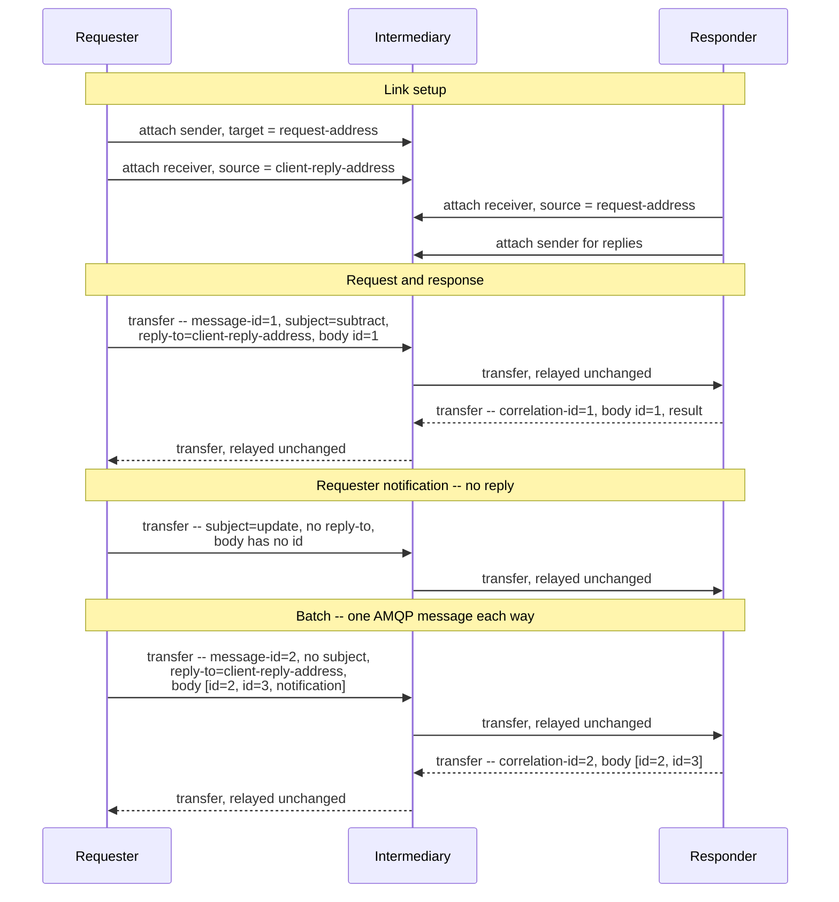

# JSON-RPC 2.0 over AMQP 1.0 -- Binding Specification

## Working Draft

> **Status of this document.** This is an early working draft prepared for discussion with the OASIS
> AMQP Technical Committee. It is intentionally incomplete: it sketches the core of a binding, and
> detail arrives over later revisions. It is not for publication or implementation.
>
> **Revision.** 2026-08-24. Revisions are listed in Appendix C, one line each, and the commit
> history of this file carries the detail. Working Draft numbering is reserved for drafts submitted
> for public review.

## 1  Introduction

JSON-RPC 2.0 [JSON-RPC] is a stateless remote procedure call protocol. It defines request, response,
and notification objects, a batch form, its own correlation identifier, and its own error taxonomy,
and it deliberately defines nothing about how those objects reach a peer. 2.0 is the current
version: the specification was issued 2010-03-26 and last revised 2013-01-04.

This document defines a binding of JSON-RPC 2.0 onto AMQP 1.0 [AMQP-v1.0]. A binding constrains only
the application endpoints, so any conforming AMQP 1.0 broker or router carries JSON-RPC traffic as
it stands.

The two protocols meet cleanly. JSON-RPC carries its correlation and its errors in the body and
holds no session state, so there is nothing for an intermediary to track and nothing to negotiate
before traffic flows. AMQP contributes what a request/response protocol otherwise builds for itself:
per-message correlation, a reply address that travels with the request, and brokered and routed
topologies in which many requesters and many responders sit behind one address.

JSON-RPC over a message broker is already common, and each deployment settles the same questions
locally -- where the reply goes, how it is matched to its request, what carries the method name,
whether a batch is one message or many. Those choices are independent, so two conforming JSON-RPC
implementations over two conforming AMQP brokers still do not interoperate. This document settles
them once, beneath any application protocol that uses JSON-RPC as its message format. MCP over AMQP
1.0 [MCP-AMQP] is such an application, inheriting the contract defined here and adding only what is
specific to it (§7).

Reusable extensions for the patterns application protocols still reinvent above this layer, and
changes to AMQP itself, belong to a separate discussion.

Deliberately out of scope for this draft: flow control and link credit, settlement policy, an
addressing convention beyond the citation in §5, and any security mechanism beyond the SASL and TLS
mechanisms AMQP already provides.

### 1.1  Normative References

- **[AMQP-v1.0]** *OASIS Advanced Message Queuing Protocol (AMQP) Version 1.0*. OASIS Standard, 29
  October 2012.
- **[AMQP-ADDR]** *AMQP Addressing Version 1.0*. Committee Specification Draft 01, 17 March 2021.
  https://docs.oasis-open.org/amqp/addressing/v1.0/csd01/addressing-v1.0-csd01.html
- **[JSON-RPC]** *JSON-RPC 2.0 Specification*, 2010-03-26, revised 2013-01-04.
  https://www.jsonrpc.org/specification
- **[RFC8259]** *The JavaScript Object Notation (JSON) Data Interchange Format*. IETF RFC 8259,
  December 2017.

### 1.2  Non-Normative References

- **[MCP-AMQP]** *MCP over AMQP 1.0 -- Binding Specification*. OASIS AMQP Technical Committee,
  working draft.

## 2  Definitions

- **JSON-RPC message** -- Any one of the four things [JSON-RPC] puts on the wire: a request object,
  a notification, a response object, or a batch of any of these.
- **Requester** -- The container that sends a request or a notification. The Client of [JSON-RPC].
- **Responder** -- The container that answers a request. The Server of [JSON-RPC]. A container may
  be a requester for some exchanges and a responder for others; the roles attach to an exchange, not
  to a container.
- **Request link** -- An AMQP link carrying requester-to-responder traffic: requests and
  notifications.
- **Reply link** -- An AMQP link carrying responder-to-requester traffic: responses, and any further
  messages an application protocol sends in answer to a request.
- **Reply address** -- The AMQP address at which a requester receives what a responder sends back to
  it, carried in the `reply-to` field of each request.

## 3  Overview

JSON-RPC traffic runs in two directions: requests and notifications from the requester, responses
back from the responder. A requester therefore uses two links, a request link on which it sends and
a reply link at which it receives. One JSON-RPC message maps to exactly one AMQP message, and a
batch is one JSON-RPC message, so it too is one AMQP message rather than one per member (§4.4). The
contract that correlates a request with what answers it travels in AMQP `properties` on each message
(§4.2), so one reply address serves however many requests a requester has in flight, any responder
instance can answer any request, and the same two links carry a requester attached directly to a
responder and one attached to an intermediary fronting a queue that many requesters share (§5).

## 4  Message Mapping

### 4.1  Body

One JSON-RPC message maps to exactly one AMQP message. The JSON-RPC object, or array in the case of
a batch, is carried unchanged in a single `data` section with `content-type` set to
`application/json`, and the body remains authoritative for method dispatch and correlation.

The binding carries the JSON text as [JSON-RPC] and [RFC8259] define it, octet for octet, and does
not transform, wrap, re-encode, or canonicalize it. It introduces no method names, since
`rpc.`-prefixed names are reserved by [JSON-RPC] for system extensions, and every field it adds
lives in an AMQP section, leaving the JSON-RPC namespace untouched.

Appendix B records an open question on whether an `amqp-value` body should also be permitted.

### 4.2  Properties

The request/response contract is the whole of what this binding requires of the wire, and it is
stated as AMQP `properties` fields, which brokers relay without interpreting:

| Field | Usage |
|-------|-------|
| `message-id` | MUST be set on every request, to a value the requester has not used for another request on the same reply address, bounded as below. Not required on a notification, though §6 gives a reason to set one. |
| `reply-to` | MUST be set on every request, to the reply address at which the requester receives what the responder sends back. Not required on a notification, which admits no reply. |
| `correlation-id` | MUST be set on every message a responder sends in answer to a request, to the value of that request's `message-id` as received, unaltered in type or representation. Absent on requests and notifications. |
| `subject` | The JSON-RPC `method` name of the message it accompanies, where set. Advisory, to allow routing and filtering without body parsing; the body remains authoritative, and a responder MUST NOT dispatch on it. MUST NOT be set on a response, which has no method, or on a batch, which has no single one. |
| `content-type` | `application/json`. |

`correlation-id` echoes the `message-id` as received. [AMQP-v1.0] admits four `message-id` types, so
an implementation that instead re-derives the value from the JSON-RPC `id` in the body may produce a
different type, or a different representation of the same value, and correlate nothing. The two
identifier spaces are unrelated: the JSON-RPC `id` is a String, a Number, or Null, the AMQP
`message-id` is a ulong, a uuid, binary, or a string, and a requester chooses each independently.
Their independence covers a case [JSON-RPC] cannot: a response to a request whose `id` could not be
determined carries `id: null` and identifies nothing in the body, while `correlation-id` still names
the request it answers.

`message-id` is unique among requests on the same reply address, not merely among those outstanding.
Uniqueness among outstanding requests alone would let a reply the responder has already sent
correlate to a reissued or redelivered request. It need not be perpetual: a value may be reused once
no message bearing it can still be delivered, which [AMQP-v1.0] bounds with `ttl` and
`absolute-expiry-time`. A requester that sets neither has no such bound and cannot safely reuse a
value at all. The reply address is the scope because that is where demultiplexing happens, and §5
requires one consuming container per reply address, so two requesters sharing a request address have
distinct reply addresses and their `message-id` values may collide harmlessly.

`correlation-id` does not say whether the message carrying it completes the request. Where an
application protocol answers one request with several messages (§7), a requester tells them apart in
the body: a response carries `result` or `error` and the `id` of the request, an intermediate
notification carries `method` and no `id`. This binding adds no AMQP field for terminality, so a
requester that needs to know whether more is coming reads the body.

### 4.3  Notifications

A notification is a request object without an `id` member, and [JSON-RPC] states that a server MUST
NOT reply to one, including one inside a batch. A responder MUST NOT send any message in answer to a
notification, and the absent `id` in the body determines this: a `reply-to` on a notification does
not make it answerable, and a requester has no reason to set one. A responder that cannot process a
notification has no channel in which to say so, which is a property of [JSON-RPC].

An application protocol may define notifications a responder sends to a requester. Those travel on
the reply link to the reply address of the request they relate to, carrying `correlation-id` per
§4.2. A notification that relates to no request has no reply address to go to; an application
protocol that needs one defines how the requester supplies it.

### 4.4  Batches

[JSON-RPC] §6 lets a requester send an Array of request objects and have the responder return an
Array of the corresponding response objects. A batch is one JSON-RPC message, so it is one AMQP
message: the Array is the body, and `message-id` and `reply-to` are set as for a single request. The
response Array likewise travels as one AMQP message carrying `correlation-id`. Splitting a batch
across AMQP messages would lose the grouping [JSON-RPC] defines it to have.

`subject` is absent on a batch, which has no single method, so an intermediary routing on `subject`
cannot route one; a requester that needs such routing sends its requests individually.

A batch that exceeds the `max-message-size` the link negotiated has no conforming representation,
since it may be neither split nor sent. A requester MUST NOT send one, and sends its requests
individually instead.

Where every member of a batch is a notification, [JSON-RPC] forbids an empty Array in reply: the
responder sends no AMQP message and the requester MUST NOT wait for one, and such a batch is a
notification for the purposes of §4.3. Where the body is not valid JSON, or is an Array with no
members, [JSON-RPC] requires a single response object, which travels as one AMQP message carrying
`correlation-id`. Where a batch mixes requests and notifications, the response Array holds an entry
per request and none per notification, still as one AMQP message.

## 5  Addressing and Topology

Every address in this binding is an AMQP address as [AMQP-ADDR] defines it: a URI reference, either
transport-independent or an AMQP URL carrying a network endpoint, in the `amqp` or `amqps` scheme.
This binding adds no address form of its own and needs no element of [AMQP-ADDR] beyond carrying an
address opaquely in `reply-to`.

A requester sends on a link targeting the responder's request address and receives at its own reply
address. A queue backing the request address may be shared by many requesters and served by many
responder instances: the per-request `reply-to` and `correlation-id` return each response to the
requester that issued it, with no shared state at the intermediary.

How a requester obtains a reply address is unconstrained. It may be pre-provisioned, declared by the
requester over whatever management interface the container offers, or allocated by the container as
a dynamic terminus where one is supported. Containers differ in which of these they offer.

A reply address MUST have exactly one consuming container. Unlike a request address it may not be
shared, so a requester fleet takes one per instance: competing consumers on a reply address would
deliver a reply to an instance that did not issue the request, which correlation cannot repair
because it happens after delivery.

A responder directs each reply to the address in the request's `reply-to`. Where that address
carries a network endpoint, [AMQP-ADDR] has the responder prioritize delivering the reply over the
connection the request arrived on, and use an outbound connection to the endpoint only if that
fails. One reply address serves a requester for as many requests as it chooses to have in flight,
because responses are demultiplexed on `correlation-id`.

Detaching with the `closed` flag set, or loss of the connection, ends the transport, but does not by
itself abandon the exchanges it carried. A request whose transfer completed is unaffected by the
requester's absence, and where the reply address outlives the connection, replies wait there for a
requester that attaches again. A request whose transfer did not complete never reached a responder,
so reissuing it is a new request rather than the duplicate §6 describes. Which case applies depends
on the nodes backing the two addresses, whose durability this binding does not constrain.

## 6  Delivery

**Duplicates.** Under `at-least-once` settlement a responder may receive the same request twice, and
a requester that reissues a request whose transfer completed has the same effect at the application
layer, whether or not it received the reply. [JSON-RPC] defines no idempotency and no deduplication,
so a reissued state-changing call may be applied twice. The binding supplies the key with which an
application protocol can fix that: `message-id` is unique per reply address by §4.2, so a responder
that retains it can recognize a redelivery of a request it has already answered. Reissuing under a
fresh `message-id` gives up that recognition, so a requester that cares about exactly-once effects
reissues under the original one, and an application protocol that cares defines which of its methods
may be reissued at all.

**Ordering.** [AMQP-v1.0] preserves the order of transfers on a link. Where an application protocol
sends several messages in answer to one request -- a stream of notifications and then the result
that closes it -- and sends them on one link, they arrive at the next hop in the order sent. This
binding claims nothing stronger. Order across two links is undefined, and what an intermediary
preserves along a longer path is that intermediary's property. A responder controls only the order
in which it sends, so an application protocol requiring its answers ordered end to end either
confines them to one link with no reordering intermediary, or carries its own sequencing for the
requester to reorder on.

**Failure.** [JSON-RPC] expects a response to every request, and this binding does not guarantee
one. A responder may reject or release the delivery, a reply address may be unreachable, and a
responder may take a request and never answer it. AMQP reports the first two to the requester as a
delivery disposition and the third not at all. This binding maps no disposition onto a JSON-RPC
error and defines no timeout, so how long a requester waits and what it concludes belong to the
application protocol. Appendix B records the mapping as open.

## 7  Application Protocols

[JSON-RPC] is a message format, not a complete application protocol. It defines no cancellation, no
streaming, no capability discovery, and no versioning beyond the `jsonrpc` member. This binding
defines none of those either; an application protocol layered on it supplies what it needs, under
two conventions.

An application protocol adds its own routing metadata as `application-properties` keys, not by
altering the body or reinterpreting the `properties` fields §4.2 assigns. Such keys are advisory: an
endpoint reads the JSON-RPC body as authoritative, and the keys exist so intermediaries can route,
filter, and meter without decoding it.

An application protocol that needs cancellation defines it in its own terms, as a notification on
the request link naming the request to abandon, and states what a responder may do on receiving one.
The binding carries such a notification as §4.3 describes and attaches no meaning to it.

Cancellation is instance-affine where every other exchange in this binding is not: a notification
sent to a request address that many instances serve reaches an arbitrary one, and `correlation-id`
is absent on notifications (§4.2), so no field of this binding routes it to the instance holding the
request. Best-effort cancellation is unaffected; anything stronger needs affinity this binding does
not supply, and Appendix B records the question.

MCP over AMQP 1.0 [MCP-AMQP] is an application of this binding. It defines cancellation as a
`notifications/cancelled` notification on the request link, in the form this section describes. It
defines a subscription stream, in which one request is answered by many messages at one reply
address, which this binding carries but does not itself define; and it requires ordering of its
server rather than of the transport, subject to §6.

## 8  Security Considerations

The binding's own surface is small: it adds no method names, no address form, and no mechanism
beyond the SASL and TLS mechanisms [AMQP-v1.0] already provides. The question it raises is
authorization of the reply path. A request carries a `reply-to` address the requester chose and the
responder is asked to send to, and two things must hold.

**The responder's right to send.** The identity the responder runs under must be permitted to send
to the address it was handed, and the requester must be able to arrange that. Where both parties
attach to the same broker and share one address space and one authorization authority, this is
tractable: the requester provisions its reply address so the identity or group the responder runs
under may send to it. Where request and reply cross address spaces or brokers, it is not, and the
mechanisms available differ by deployment. [AMQP-ADDR] shows one direction, a reply address carrying
a token as a URI query parameter that delegates limited access.

**The requester's entitlement to nominate.** Something must assure the system that the requester was
entitled to name that address at all. Absent that, a requester-supplied reply path is a way to make
a responder emit traffic to a destination of the requester's choosing, which makes the responder a
relay. This is the likelier interop hurdle, because containers differ widely in what a sender may do
with an address it names rather than attaches to, so a rule stated in terms of one container's model
will not carry to another.

A deployment accepting requests from untrusted requesters therefore constrains which reply addresses
it will honor, with no portable vocabulary in which to express that constraint today. And a
requester whose reply address is writable by any responder identity will accept replies it did not
provoke, which `correlation-id` limits but does not prevent, since a `message-id` is unique but need
not be unguessable. The answer likely constrains deployments rather than the wire contract in §4.

`subject` is not a security boundary. §4.2 requires it to carry the `method` of the message it
accompanies, but it is sender-supplied, and an intermediary cannot detect a divergence from the body
without the parse `subject` exists to avoid. Routing, filtering and metering degrade gracefully
under a forged value. An authorization decision does not, and MUST NOT be taken on `subject`. The
same holds for the `application-properties` keys §7 admits.

## 9  Conformance

A **requesting container** conforms to this binding if it sets `reply-to` on every request to an
address at which it can receive messages and which no other container consumes, sets `message-id` to
a value not in use for another request on that address within the bound §4.2 gives, correlates each
reply it receives to a request on `correlation-id`, expects no reply to a notification, and, where
it sets `subject`, sets it to the `method` of the message it accompanies and omits it on a batch.

A **responding container** conforms to this binding if it sets `correlation-id` on every message it
sends in answer to a request, to that request's `message-id`, directs each of them to the address in
the request's `reply-to`, sends nothing in answer to a notification or to an all-notification batch,
dispatches on the `method` in the body rather than on `subject`, and omits `subject` from every
response and every batch it sends.

Both roles carry each JSON-RPC message unchanged in a single `data` section as §4.1 defines, carry a
batch as one AMQP message as §4.4 defines, and preserve the request, response, notification, batch,
and error semantics of [JSON-RPC] end to end, with one departure: a request may be answered by more
than one message where an application protocol defines it (§7), which [JSON-RPC] does not admit.
Neither role is required to answer every request, per the failure cases in §6.

## Appendix A  Example Exchange (Informative)

A minimal exchange through an intermediary: link setup, one request answered by one response, one
notification in each direction, and one batch. Addresses are shown as placeholders; their format is
container-specific. Only the fields relevant to the binding are shown.

The intermediary relays each transfer unchanged. Delete it and the direct case remains, with the
requester's links attached to the responder and the same `properties` carrying the exchange. The
batch response Array holds two entries for three members, since the notification in the batch is not
answered, and the requester's own notification produces no AMQP message in return.

## Appendix B  Open Questions (Informative)

Recorded for Technical Committee discussion.

| Question | Detail |
|----------|--------|
| `amqp-value` body | §4.1 requires a `data` section. An `amqp-value` body is more compact, and most AMQP client libraries will encode a JSON object into one without the application doing so. The cost is fidelity: the round trip through AMQP types does not distinguish an omitted `params` member from a null one, nor an absent `id` from `id: null`, which is the distinction between a request and a notification, and JSON numbers admit more than one AMQP numeric type. A permissive rule would need to say which encoding is canonical for interoperation and what a responder does with the one it did not expect, and would displace the `content-type` §4.1 requires. |
| Exactly-once effects | §6 supplies `message-id` as a deduplication key but requires nothing of a responder. Whether the binding should require duplicate suppression is open, as is whether AMQP settlement state can carry more of the weight than this draft assumes. The retention window is the same quantity that bounds `message-id` reuse in §4.2, so a responder's dedup memory and a requester's `ttl` are one decision rather than two. |
| Failure signalling | A JSON-RPC error is a response and travels as one, which keeps the taxonomy in [JSON-RPC] where it belongs. Open: whether a `rejected` or `released` disposition should surface to the requester as a synthesized JSON-RPC error, and with what code from the -32000 to -32099 implementation-defined band; and whether the binding should say anything about how long a requester waits for a response that never arrives, which §6 currently leaves to the application protocol. |
| Cancellation affinity | §7 leaves cancellation best-effort where a request address is served by many responder instances, since no field of this binding routes a notification to the instance holding the request. Whether the binding should supply an affinity mechanism, or an address a responder publishes for messages concerning a request in progress, is open. |
| Reply-path authorization | §8 scopes the problem. The cross-address-space case has no answer here. |

## Appendix C  Revision History (Informative)

Newest first. One line per revision; the commit history of this file carries the detail.

| Date | Change |
|------|--------|
| 2026-08-24 | First draft submitted to the Technical Committee for discussion, following the 2026-08-11 meeting's agreement to propose a JSON-RPC binding with [MCP-AMQP] as an application of it. |
