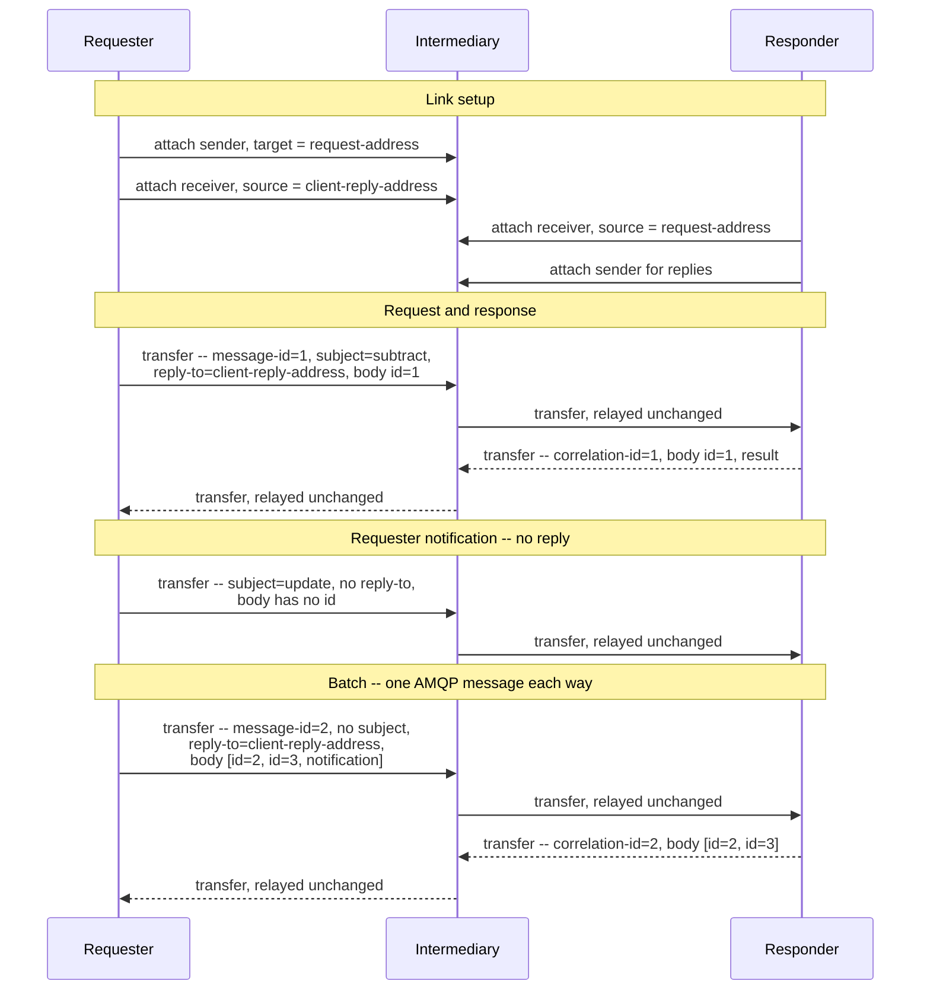

# JSON-RPC 2.0 over AMQP 1.0 -- Binding Specification Version 1.0

## Working Draft 01

## 08 October 2026

Standards Track Work Product. Prepared for a ballot to approve Committee Specification Draft 01
and authorize its first 30-day public review; neither approval nor public review has occurred.

### This Stage

Not yet published. Proposed CSD01 locations, subject to OASIS registration and confirmation:

- Markdown (proposed authoritative format):
  `https://docs.oasis-open.org/amqp/jsonrpc-amqp/v1.0/csd01/jsonrpc-amqp-v1.0-csd01.md`
- HTML: `https://docs.oasis-open.org/amqp/jsonrpc-amqp/v1.0/csd01/jsonrpc-amqp-v1.0-csd01.html`
- PDF: `https://docs.oasis-open.org/amqp/jsonrpc-amqp/v1.0/csd01/jsonrpc-amqp-v1.0-csd01.pdf`

### Previous Stage

N/A. This work product has no approved publication identified in this draft.

### Latest Stage

Not yet published. Proposed latest-stage locations, subject to OASIS confirmation:

- Markdown: `https://docs.oasis-open.org/amqp/jsonrpc-amqp/v1.0/jsonrpc-amqp-v1.0.md`
- HTML: `https://docs.oasis-open.org/amqp/jsonrpc-amqp/v1.0/jsonrpc-amqp-v1.0.html`
- PDF: `https://docs.oasis-open.org/amqp/jsonrpc-amqp/v1.0/jsonrpc-amqp-v1.0.pdf`

### Technical Committee

[OASIS Advanced Message Queuing Protocol (AMQP) TC](https://www.oasis-open.org/committees/amqp/)

### Chairs

- Rob Godfrey, IBM
- Clemens Vasters (<clemensv@microsoft.com>), Microsoft

### Editors

- Stefan Moser, AWS
- Vignesh Selvam, AWS

### Abstract

This specification defines the representation of JSON-RPC 2.0 messages on AMQP 1.0, including
message bodies, request/reply properties, notifications, batches, and correlation. It applies to
direct connections and to connections through intermediaries.

### Citation Format

**[JSONRPC-AMQP]** *JSON-RPC 2.0 over AMQP 1.0 -- Binding Specification Version 1.0*, OASIS
Advanced Message Queuing Protocol (AMQP) TC, Working Draft 01, 08 October 2026. [Online]. Available:
[TC repository](https://github.com/oasis-tcs/amqp-specs/tree/master/jsonrpc).

### Related Work

This document is related to *MCP over AMQP 1.0 -- Binding Specification Version 1.0* [MCP-AMQP],
which defines an application of this binding.

## License, Document Status, and Notices

Copyright © OASIS Open 2026. All Rights Reserved. For license and copyright information and
complete status, see [Annex A](#annex-a-license-document-status-and-notices).

## Table of Contents

- [1 Scope](#1-scope)
- [2 Definitions](#2-definitions)
- [3 Document Conventions](#3-document-conventions)
- [4 Introduction](#4-introduction)
- [5 Overview](#5-overview)
- [6 Message Mapping](#6-message-mapping)
- [7 Addressing and Topology](#7-addressing-and-topology)
- [8 Delivery](#8-delivery)
- [9 Application Protocols](#9-application-protocols)
- [10 Safety, Security, and Data Protection Considerations](#10-safety-security-and-data-protection-considerations)
- [11 Conformance](#11-conformance)
- [Annex A License, Document Status and Notices](#annex-a-license-document-status-and-notices)
- [Annex B References](#annex-b-references)
- [Appendix 1 Acknowledgments](#appendix-1-acknowledgments)
- [Appendix 2 Changes From Previous Version](#appendix-2-changes-from-previous-version)
- [Appendix 3 Example Message Flow](#appendix-3-example-message-flow)
- [Appendix 4 Open Questions](#appendix-4-open-questions)

## 1 Scope

This specification defines a binding of JSON-RPC 2.0 onto AMQP 1.0 [AMQP-v1.0].

It is not in scope for this specification to define how a requester and a responder manage link
credit, what address forms they use beyond the citation in §7, or any security mechanism beyond the
SASL and TLS mechanisms AMQP already provides. Settlement policy is left to the peers, with §8
supplying `message-id` as a deduplication key. It does not define how a requester learns that a
request went unanswered, or how long it waits before concluding one will not arrive; Appendix 4
records both as open.

## 2 Definitions

- **JSON-RPC message** -- Any one of the three forms [JSON-RPC] puts on the wire: a request object,
  a response object, or a batch of either.
- **Requester** -- The container that sends a request or a notification. The Client of [JSON-RPC].
- **Responder** -- The container that answers a request. The Server of [JSON-RPC]. A container may
  be a requester for some requests and a responder for others; the roles attach to a request, not
  to a container.
- **Request link** -- An AMQP link carrying requester-to-responder traffic: requests and
  notifications.
- **Reply link** -- An AMQP link carrying responder-to-requester traffic: responses, and any further
  messages an application protocol sends in answer to a request.
- **Request address** -- The AMQP address at which a responder receives requests and notifications.
- **Reply address** -- The AMQP address to which a responder sends what answers a request.

## 3 Document Conventions

### 3.1 Key Words

The key words "MUST", "MUST NOT", "REQUIRED", "SHALL", "SHALL NOT", "SHOULD", "SHOULD NOT",
"RECOMMENDED", "NOT RECOMMENDED", "MAY", and "OPTIONAL" in this document are to be interpreted
as described in BCP 14 [RFC2119] [RFC8174] when, and only when, they appear in all capitals,
as shown here.

### 3.2 Typographical Conventions

Monospace text identifies AMQP fields, JSON members, literal values, and protocol identifiers.
References in square brackets identify entries in Annex B. Section references identify sections
of this document unless a referenced document is named explicitly.

## 4 Introduction

JSON-RPC 2.0 [JSON-RPC] is a stateless remote procedure call protocol. It defines request, response,
and notification objects, a batch form, its own correlation identifier, and its own error taxonomy.

JSON-RPC carried through an intermediary is already common, and each deployment solves the same set
of problems for itself. This document defines a binding of JSON-RPC 2.0 onto AMQP 1.0 [AMQP-v1.0]
that solves that set once, so implementations that conform to this binding interoperate.

### 4.1 Changes From the Previous Version

Changes and revision history are recorded in Appendix 2.

## 5 Overview

JSON-RPC traffic runs in two directions. Requests and notifications from the requester travel on a
request link to the responder. Responses and notifications from the responder travel on a reply link
to the requester. A container in both roles keeps its links in each role independent of its links in
the other. One JSON-RPC message maps to exactly one AMQP message, including batches. The contract
that correlates a request with what answers it travels in AMQP `properties` on each message (§6.2).
One reply address serves however many requests a requester has in flight, and the same two links
serve a requester attached directly to a responder and one attached to an intermediary where many
requesters share a request address (§7).

## 6 Message Mapping

### 6.1 Body

One JSON-RPC message maps to exactly one AMQP message. The JSON-RPC object, or array in the case of
a batch, is carried unchanged in a single `data` section with `content-type` set to
`application/json`, and the body remains authoritative for method dispatch and correlation.

The binding carries the JSON text octet for octet, and that text MUST be encoded using UTF-8
[RFC8259]. Every field the binding adds lives in an AMQP section.

### 6.2 Properties

This binding requires the request/response contract to be stated as AMQP `properties` fields, which
intermediaries relay without interpreting, as listed in Table I.

Table I. JSON-RPC Message Properties

| Field | Usage |
| ------- | ------- |
| `message-id` | MUST be set on every message, to a globally unique value the requester has not used before. |
| `reply-to` | MUST be set on every request, to the reply address to which the responder sends what answers the request. MUST NOT be set on a notification. |
| `correlation-id` | MUST be set on every message a responder sends in answer to a request, to the value of that request's `message-id` as received, unaltered in type or representation. Absent on requests and on requester-sent notifications. A response whose request `id` could not be determined carries `id: null` in the body and still correlates here. |
| `subject` | The JSON-RPC `method` name of the message it accompanies. Where set, it MUST equal the method defined in the body, so an intermediary MAY route and filter on it. Absent on a response. |
| `content-type` | `application/json` |

A responder MUST retain each request's `message-id` and `reply-to` for as long as it may still
send a message in answer to that request, and MUST take the `correlation-id` and the destination of
each such message from what it retained.

A requester reads whether a message completes a request from the body. Where an application protocol
answers one request with several messages, a response carries `result` or `error` and the request's
`id`, while an intermediate notification carries `method` and no `id`.

### 6.3 Notifications

A notification is a request object without an `id` member, and [JSON-RPC] states that a server MUST
NOT reply to one, including one inside a batch. A responder MUST NOT send any message in answer to a
notification; the absent body `id` marks it, consistent with the body remaining authoritative
(§6.1). A responder that cannot process a notification stays silent, since [JSON-RPC] defines no
response for one.

An application protocol MAY define notifications a responder sends to a requester. Those travel on
the reply link to the reply address of the request they relate to, carrying `correlation-id` per
§6.2.

### 6.4 Batches

[JSON-RPC] §6 lets a requester send an Array of request objects and have the responder return an
Array of the corresponding response objects. A batch is one JSON-RPC message, so it is one AMQP
message: the Array is the body, and `message-id` and `reply-to` are set as for a single request. The
response Array likewise travels as one AMQP message carrying `correlation-id`. Within a batch, a
requester matches each response object to its request by the body `id`.

`subject` is absent on a batch, which has no single method, so an intermediary routing on `subject`
cannot route one; a requester that needs such routing sends its requests individually.

Where every member of a batch is a notification, [JSON-RPC] forbids an empty Array in reply. A
responder MUST NOT send an AMQP message in that case, and such a batch is a notification for the
purposes of §6.3. Where the batch is an Array with no members, [JSON-RPC] requires a single response
object, which travels as one AMQP message carrying `correlation-id`.
Where a batch mixes requests and notifications, the response Array holds an entry per request and
none per notification, still as one AMQP message.

### 6.5 Errors

A request whose body is not valid JSON draws the single parse-error response [JSON-RPC] defines,
carried as one AMQP message with `correlation-id` set from the request's `message-id` and sent to
its `reply-to`. An unparseable request that carried neither gives the responder nothing to correlate
or address a response with, so it settles the delivery and sends nothing.

An attempt to deliver a message larger than the `max-message-size` the peer declared at attach
results in an `amqp:link:message-size-exceeded` link error. The layer that assembled a batch MAY
instead issue its members as individual messages, each its own AMQP message under its own
`message-id`. A single oversize request or notification has no such recourse: it is one JSON-RPC
message (§6.1) and cannot be divided.

## 7 Addressing and Topology

Every address in this binding is an AMQP address as [AMQP-ADDR] defines it, carried opaquely: this
binding needs no element of [AMQP-ADDR] beyond `reply-to` carrying one.

Where a responder dispatches a request beyond its own process, it carries along with it the
`message-id` and `reply-to` values §6.2 requires it to retain.

How a requester obtains a reply address is unconstrained: pre-provisioned, declared over a
container's management interface, or allocated as a dynamic terminus where one is supported.

Where the address in a request's `reply-to` carries a network endpoint, [AMQP-ADDR] §3.2.3 gives a
responder's connection back to the requester a role in delivering the reply; Appendix 4 records what
that entails as open.

Detaching with the `closed` flag set, or loss of the connection, ends the transport. It does not by
itself abandon the requests the transport carried. A request whose transfer completed is unaffected
by the requester's absence, and where the reply address outlives the connection, replies wait there
for a requester that attaches again. A request whose transfer did not complete never reached a
responder, so reissuing it is a new request rather than the duplicate §8 describes. Which case
applies depends on the nodes backing the two addresses, whose durability this binding does not
constrain.

### 7.1 Temporary Reply Nodes

This subsection is non-normative.

Where a peer supports receiver-created dynamic sources, a requester can allocate a temporary reply
queue by attaching its reply receiver with an addressless source whose `dynamic` field is `true`.
The temporary-queue profile in [AMQP-JMS-MAP] supplies the `temporary-queue` capability and a
`lifetime-policy` of `delete-on-close`. The example requests `durable=none` and
`expiry-policy=link-detach`; the peer's attach response determines the node's actual properties.

```amqp
attach(
  name={unique reply-link name},
  role=receiver,
  source={
    durable=none,
    expiry-policy=link-detach,
    dynamic=true,
    dynamic-node-properties={
      :"lifetime-policy"=delete-on-close
    },
    capabilities=[temporary-queue]
  },
  target=null
)
```

On success, the peer's attach response has a source containing the assigned address. The requester
uses that address opaquely: once its receiver is attached and credited, it sets the request's AMQP
`reply-to` to the address. The responder attaches a sender to that address and sets the reply's
`correlation-id` from the request's `message-id` (§6.2). The requester receives and settles replies
on the same link that requested the dynamic source. No second receiver or creating sender link is
needed.

A peer may refuse dynamic source creation or return no usable source address. The requester then
needs another reply-address arrangement before sending requests. It must not assume that an address
assigned to a temporary node survives the reply link's closure or a connection interruption. Even
when the requested lifetime policy is honored, replies sent after the node is deleted cannot reach
the requester through that address.

## 8 Delivery

**Duplicates.** [JSON-RPC] does not define idempotency or deduplication. An application protocol
that needs to recognize a redelivered request SHOULD check for a repeated `message-id` (§6.2).

**Ordering.** [AMQP-v1.0] guarantees order between the two endpoints of a link. What an intermediary
preserves beyond one hop is that intermediary's property. Where an application protocol answers one
request with several messages (§6.2), a responder controls only the order in which it sends them.

## 9 Application Protocols

An application protocol adds its own routing metadata as `application-properties` keys. Such keys
are advisory: an endpoint reads the JSON-RPC body as authoritative, and the keys exist so
intermediaries can route, filter, and meter without decoding it.

Cancellation, where an application protocol defines one, rides as an ordinary notification on the
request link naming the request to abandon (§6.3); this binding attaches no meaning to it. It is
instance-affine where the rest of this binding is not: a notification sent to a request address
that many instances serve reaches an arbitrary one, and `correlation-id` is absent on a
requester-sent notification (§6.2), so no field of this binding routes it to the instance holding
the request. An application protocol that needs stronger delivery than best-effort supplies its own
affinity mechanism; Appendix 4 records the question.

## 10 Safety, Security, and Data Protection Considerations

### 10.1 Security Considerations

A request carries a `reply-to` address the requester chose and the responder is asked to send to.
Two things must hold: the responder's right to send there, and the requester's entitlement to
nominate that address at all.

**The responder's right to send.** The identity the responder runs under must be permitted to send
to the address it was handed, and the requester must be able to arrange that. Where both parties
share one address space and one authorization authority, the requester provisions its reply address
so the identity or group the responder runs under may send to it. Where request and reply cross
address spaces, the mechanisms available differ by deployment; [AMQP-ADDR] shows one, a reply
address carrying a token as a URI query parameter that delegates limited access.

**The requester's entitlement to nominate.** Something must assure the system that the requester was
entitled to name that address at all. Absent that, a requester-supplied reply path is a way to make
a responder emit traffic to a destination of the requester's choosing, which makes the responder a
relay. This is the likelier interop hurdle: containers differ widely in what a sender may do with an
address it names rather than attaches to, so a rule stated in terms of one container's model does
not carry to another. Appendix 4 records the cross-address-space case as open.

`subject` is not a security boundary. §6.2 requires it to carry the `method` of the message it
accompanies, but it is sender-supplied, and an intermediary cannot detect a divergence from the body
without the parse `subject` exists to avoid. Routing, filtering, and metering are unaffected by a
forged value; an authorization decision MUST NOT be taken on `subject`. The same holds for the
`application-properties` keys §9 admits.

### 10.2 Safety and Data Protection Considerations

This binding defines no additional safety or data protection mechanism. Its security scope is
stated in §1; application protocols and deployments determine the treatment of their payloads.

## 11 Conformance

A **requesting container** conforms to this binding if it:

1. sets `message-id` and `reply-to` on every request as §6.2 requires;
2. correlates each reply it receives to a request by `correlation-id`;
3. expects no reply to a notification, per §6.3.

A **responding container** conforms to this binding if it:

1. sets `correlation-id` on every message it sends in answer to a request, as §6.2 requires;
2. sends nothing in answer to a notification or to an all-notification batch, per §6.3 and §6.4;
3. omits `subject` from every response and every batch it sends, as §6.2 and §6.4 require.

Both roles carry the body and batches as §6.1 and §6.4 require, and preserve [JSON-RPC] semantics
end to end, with one departure: a request may be answered by more than one message where an
application protocol defines it (§6.2), which [JSON-RPC] does not admit. Neither role is required
to answer every request; §1 leaves how a requester learns of that out of scope.

## Annex A License, Document Status and Notices

(This annex forms an integral part of this Specification.)

### A.1 Document Status

This document was last revised by the OASIS Advanced Message Queuing Protocol (AMQP) TC on the
above date. It is a Working Draft and has not been approved as a Committee Specification Draft.
The product registration, publication URIs, and authoritative format remain
subject to TC and OASIS Administration confirmation. Other technical work produced by the TC is
listed at <https://www.oasis-open.org/committees/amqp/>.

TC members should send comments to the TC's general email list. Others should use the
[TC's public comment facility](https://groups.oasis-open.org/communities/community-home?communitykey=f83ec4e4-c2ad-4e1f-b9d2-018f5aa7a390)
after obtaining access through the [comment signup form](https://www.oasis-open.org/comment-signup/)
and accepting the OASIS Feedback License. Public comments are not accepted through GitHub.

Any machine-readable content (Computer Language Definitions) declared Normative for this Work
Product is provided in separate plain text files. In the event of a discrepancy between any such
plain text file and display content in the Work Product's prose narrative document(s), the content
in the separate plain text file prevails. This draft contains no such separate normative artifacts.

### A.2 License and Notices

Copyright © OASIS Open 2026. All Rights Reserved.

All capitalized terms in the following text have the meanings assigned to them in the OASIS
Intellectual Property Rights Policy (the "OASIS IPR Policy"). The full Policy, which governs the
licensure of this document, may be found at the OASIS website:
<https://www.oasis-open.org/policies-guidelines/ipr/>.

This document and translations of it may be copied and furnished to others, and derivative works
that comment on or otherwise explain it or assist in its implementation may be prepared, copied,
published, and distributed, in whole or in part, without restriction of any kind, provided that the
above copyright notice and this section are included on all such copies and derivative works.
However, this document itself may not be modified in any way, including by removing the copyright
notice or references to OASIS, except as needed for the purpose of developing any document or
deliverable produced by an OASIS Technical Committee (in which case the rules applicable to
copyrights, as set forth in the OASIS IPR Policy, must be followed) or as required to translate it
into languages other than English.

The limited permissions granted above are perpetual and will not be revoked by OASIS or its
successors or assigns, as provided in the OASIS IPR Policy.

This document is provided under the RF on RAND IPR mode that was chosen when the project was
established, as defined in the IPR Policy. For information on whether any patents have been
disclosed that may be essential to implementing this document, and any offers of patent licensing
terms, please refer to the [Intellectual Property Rights section of the TC's web page](https://www.oasis-open.org/committees/amqp/ipr.php).

This document and the information contained herein is provided on an "AS IS" basis and OASIS
DISCLAIMS ALL WARRANTIES, EXPRESS OR IMPLIED, INCLUDING BUT NOT LIMITED TO ANY WARRANTY THAT THE
USE OF THE INFORMATION HEREIN WILL NOT INFRINGE ANY OWNERSHIP RIGHTS OR ANY IMPLIED WARRANTIES OF
MERCHANTABILITY OR FITNESS FOR A PARTICULAR PURPOSE. OASIS AND ITS MEMBERS WILL NOT BE LIABLE FOR
ANY DIRECT, INDIRECT, SPECIAL OR CONSEQUENTIAL DAMAGES ARISING OUT OF ANY USE OF THIS DOCUMENT OR
ANY PART THEREOF.

The name "OASIS" is a trademark of OASIS, the owner and developer of this document, and should be
used only to refer to the organization and its official outputs. OASIS welcomes reference to, and
implementation and use of, its documents, while reserving the right to enforce its marks against
misleading uses. Please see <https://www.oasis-open.org/policies-guidelines/trademark/> for guidance.

## Annex B References

(This annex forms an integral part of this Specification.)

Normative references identify the specific editions used by this binding. Informative references
provide context and are not required to implement this binding.

### B.1 Normative References

- **[AMQP-v1.0]** *OASIS Advanced Message Queuing Protocol (AMQP) Version 1.0*, OASIS Standard,
  29 October 2012. [Online]. Available:
  <https://docs.oasis-open.org/amqp/core/v1.0/os/amqp-core-complete-v1.0-os.pdf>.
- **[AMQP-ADDR]** *AMQP Addressing Version 1.0*, Committee Specification Draft 01,
  17 March 2021. [Online]. Available:
  <https://docs.oasis-open.org/amqp/addressing/v1.0/csd01/addressing-v1.0-csd01.html>.
- **[JSON-RPC]** *JSON-RPC 2.0 Specification*, 26 March 2010, revised 04 January 2013.
  [Online]. Available: <https://www.jsonrpc.org/specification>.
- **[RFC8259]** T. Bray, *The JavaScript Object Notation (JSON) Data Interchange Format*,
  RFC 8259, December 2017. [Online]. Available: <https://www.rfc-editor.org/info/rfc8259>.
- **[RFC2119]** S. Bradner, *Key Words for Use in RFCs to Indicate Requirement Levels*, BCP 14,
  RFC 2119, March 1997. [Online]. Available: <https://www.rfc-editor.org/info/rfc2119>.
- **[RFC8174]** B. Leiba, *Ambiguity of Uppercase vs Lowercase in RFC 2119 Key Words*, BCP 14,
  RFC 8174, May 2017. [Online]. Available: <https://www.rfc-editor.org/info/rfc8174>.

### B.2 Informative References

- **[AMQP-JMS-MAP]** *AMQP Bindings and Mappings for JMS Version 1.0*. OASIS AMQP Technical
  Committee, Working Draft 10, 21 August 2020. [Online]. Available:
  <https://groups.oasis-open.org/higherlogic/ws/public/download/67638/amqp-bindmap-jms-v1.0-wd10.pdf>.
- **[MCP-AMQP]** *MCP over AMQP 1.0 -- Binding Specification Version 1.0*, OASIS Advanced
  Message Queuing Protocol (AMQP) TC, working draft. [Online]. Available:
  <https://github.com/oasis-tcs/amqp-specs/tree/master/mcp>.

## Appendix 1 Acknowledgments

(This appendix does not form an integral part of this Specification and is informational.)

Stefan Moser contributed the binding drafts recorded in the TC repository. This acknowledgment
does not designate a work product editor.

## Appendix 2 Changes From Previous Version

(This appendix does not form an integral part of this Specification and is informational.)

### Revision History

Newest first. One line per revision; the commit history of this file carries the detail.

Table II. Revision History

| Date | Change |
| ------ | -------- |
| 2026-10-08 | Prepare Working Draft 01 using the OASIS Markdown master template; add cover metadata, conventions, status and notices; reorganize references and informative appendices; renumber sections and update internal references. Protocol requirements are unchanged. |
| 2026-09-25 | Add non-normative guidance for receiver-created temporary queue reply nodes. |
| 2026-09-17 | Correct statements attributed to [JSON-RPC], [AMQP-v1.0] and [RFC8259] that those specifications do not make; resolve the contradictions on `message-id` reuse and on `correlation-id` presence; require UTF-8 in §6.1 rather than through a `content-type` parameter [RFC8259] declines to define; and remove justification from the normative sections. |
| 2026-08-24 | First draft submitted to the Technical Committee for discussion, following the 2026-08-11 meeting's agreement to propose a JSON-RPC binding with [MCP-AMQP] as an application of it. |

## Appendix 3 Example Message Flow

(This appendix does not form an integral part of this Specification and is informational.)

A minimal flow through an intermediary is shown in Fig. 1: link setup, one request answered by one response, one
notification in each direction, and one batch. Addresses are shown as placeholders; their format is
container-specific. Only the fields relevant to the binding are shown.

Fig. 1. Example Message Flow



The intermediary relays each transfer unchanged. Delete it and the direct case remains, with the
requester's links attached to the responder and the same `properties` carrying the correlation. The
batch response Array holds two entries for three members, since the notification in the batch is not
answered, and the requester's own notification produces no AMQP message in return.

## Appendix 4 Open Questions

(This appendix does not form an integral part of this Specification and is informational.)

Questions recorded for Technical Committee discussion are listed in Table III.

Table III. Open Questions

| Question | Detail |
| ---------- | -------- |
| Body section type | §6.1 requires a `data` section carrying `content-type: application/json`. Review raised two alternatives. An `amqp-value` holding a string also constrains the body to UTF-8 and carries the JSON octets unchanged, differing from `data` only in section type; on this reading the choice is which section a requester reaches for by default. An `amqp-value` holding a map is more compact, and most AMQP client libraries encode a JSON object into one without the application asking, but it loses fidelity: the round trip through AMQP types does not distinguish an omitted `params` member from a null one, nor an absent `id` from `id: null`, which is the distinction between a request and a notification, and JSON numbers admit more than one AMQP numeric type. Permitting more than one representation requires naming which is canonical for interoperation, saying what a responder does with one it did not expect, and stating what `content-type`, if any, accompanies each. |
| Batching model | §6.4 carries a batch as one AMQP message to preserve the semantics [JSON-RPC] gives the batch as a whole. Review noted that AMQP transfers many messages in rapid succession and settles them asynchronously, so a binding could instead decompose a batch into its member messages and not carry the batch form on the wire at all. That trades those semantics and the single batched response for per-message settlement and routing, and changes how an all-notification batch, a batch-level parse error, and an oversize batch (§6.5) are represented. Whether to keep the batch as one message or decompose it is open. |
| Exactly-once effects | §8 supplies `message-id` as a deduplication key but requires nothing of a responder. Whether the binding should require duplicate suppression is open, as is whether AMQP settlement state can carry more of the weight than this draft assumes. Since a `message-id` is never reused, the open quantity is how long a responder must remember one to recognize a redelivery. |
| Failure signalling | A JSON-RPC error is a response and travels as one, which keeps the taxonomy in [JSON-RPC]. Open: whether a `rejected` or `released` disposition should surface to the requester as a synthesized JSON-RPC error, and with what code from the -32000 to -32099 implementation-defined band; and whether the binding should say anything about how long a requester waits for a response that never arrives, which §1 currently leaves to the application protocol. |
| Cancellation affinity | §9 leaves cancellation best-effort where a request address is served by many responder instances, since no field of this binding routes a notification to the instance holding the request. Whether the binding should supply an affinity mechanism, or an address a responder publishes for messages concerning a request in progress, is open. |
| Multi-message response signalling | §6.2 reads terminality from the body and adds no `properties` field for it. Review raised two candidates for the case where an application protocol answers one request with several messages. A `group-id` shared by those messages would let a container that pins a group to one consumer keep them together, giving a multi-message answer affinity. An explicit end-of-response marker would let a requester recognize the last message without parsing the body. Either moves work into `properties` at the cost of a field the binding does not currently require, and an end marker would need to say how it rides alongside the final response. |
| Reply-path authorization | §10 scopes the problem. The cross-address-space case has no answer here. |
| Reply delivery across address spaces | §7 cites [AMQP-ADDR] §3.2.3 for a `reply-to` carrying a network endpoint. That clause requires (SHOULD) delivery over the connection the request arrived on and an outbound connection to the endpoint only on failure, but does not say what a responder does when the endpoint names a container other than the one the request arrived through: whether a paired-link handshake to that container's `$me`, delivery annotations carrying a return path, or something else applies. Whether this binding should say more than [AMQP-ADDR] does for that case is open. |
