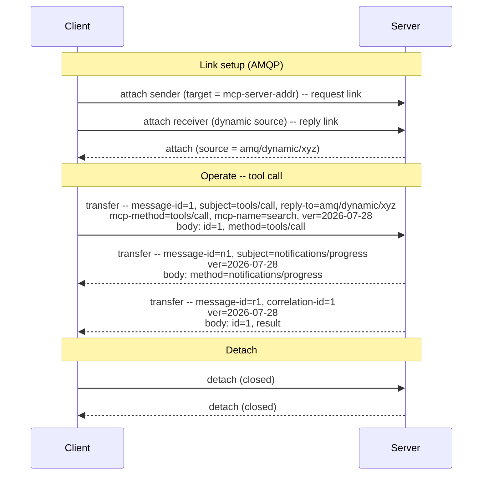

# MCP over AMQP 1.0 -- Binding Specification

## Working Draft 02

> **Status of this document.** This is an early working draft prepared for discussion with the OASIS AMQP Technical Committee. It is intentionally incomplete: it sketches the core of a binding to establish whether the overall approach is sound before detail is added. It is not for publication or implementation. Many details are deferred to later revisions.
>
> **Revision note (Working Draft 02).** This revision tracks MCP specification version 2026-07-28, which makes MCP a stateless request/response protocol. The `initialize`/`initialized` handshake and the `Mcp-Session-Id` header are retired, and the server-initiated requests that previously made MCP bidirectional (sampling, elicitation, roots) are replaced by a client-driven multi round-trip pattern. The binding is simpler as a result: it maps onto AMQP request/reply rather than onto a stateful session. Sections 2, 3, 5, and 6 are the material changes from Working Draft 01.

## 1  Introduction

The Model Context Protocol (MCP) is an open protocol that connects LLM applications to external tools and data sources. It uses JSON-RPC 2.0, and as of version 2026-07-28 it is a stateless request/response protocol: each request carries its own protocol version, client identity, and capabilities, so any request can be served by any server instance without shared session state. MCP currently defines two transports: stdio and Streamable HTTP.

This document defines a third option: a binding of MCP onto AMQP 1.0. A binding constrains only the application endpoints. It places no requirements on AMQP infrastructure, so any conforming AMQP 1.0 broker or router can carry MCP traffic without modification.

MCP's transports today assume a direct, client-initiated connection. AMQP opens MCP to the brokered and routed topologies that production messaging deployments already use, including paths that cross network boundaries and carry many clients over one connection. MCP's semantics are unchanged; only the carriage is different. AMQP also offers mechanisms such as credit-based flow control and settlement that a later revision can map to MCP's needs; this draft does not yet specify that mapping.

This binding is intentionally step one, and it stands on its own. Because MCP carries its own correlation and error semantics in-band, today's unmodified AMQP is enough to run it; nothing here depends on future work. Later steps could go further, standardizing the patterns that application protocols over AMQP each tend to reinvent (for example progressive responses, cancellation, and capability discovery) as reusable extensions, and some may warrant changes to AMQP itself. Those are worth pursuing, but they belong to a separate discussion that follows this binding rather than gating it.

### 1.1  Normative References

- **[AMQP-v1.0]** *OASIS Advanced Message Queuing Protocol (AMQP) Version 1.0*.
- **[MCP]** *Model Context Protocol Specification*, version 2026-07-28. https://modelcontextprotocol.io
- **[JSON-RPC]** *JSON-RPC 2.0 Specification*. https://www.jsonrpc.org/specification

## 2  Definitions

- **MCP request/response exchange** -- A single JSON-RPC request from an MCP client and the correlated JSON-RPC response the server returns, as defined in [MCP]. MCP no longer defines a stateful session lifecycle; each exchange is independent and self-describing.
- **AMQP session** -- The transport-level multiplexing unit (a channel pair on an AMQP connection) that carries link traffic, as defined in [AMQP-v1.0].
- **Request link** -- A unidirectional AMQP link carrying client-to-server traffic: the client's requests and notifications.
- **Reply link** -- A unidirectional AMQP link carrying server-to-client traffic: responses to the client's requests, and any server-to-client notifications the client has opted into.
- **Link pair** -- A request link and a reply link on the same AMQP session, together forming the request/reply transport for one client.

## 3  Overview

The premise of this binding is that MCP is a complete application protocol whose semantics live entirely at the endpoints. It defines its own message correlation (JSON-RPC `id`) and error reporting, and as of 2026-07-28 it carries its protocol version, client identity, and capabilities in each request rather than in negotiated session state. An AMQP broker or router carrying MCP has no reason to inspect method names or request contents; it simply delivers messages between endpoints, exactly as it would for any other payload. Where the binding surfaces identifiers such as the method name, the target name, and the protocol version into AMQP `properties` and `application-properties`, it does so only to enable optional routing and filtering by intermediaries that choose to use them; acting on these fields is never required, so the no-modification claim holds.

For that reason the correct instrument is a binding, not an AMQP extension and not a profile. There is no infrastructure-level behavior to add and no need to subset AMQP: MCP's correlation and error semantics live in the JSON-RPC body, and the base AMQP primitives (the message sections, unidirectional links, dynamic termini) are enough to carry them. The rest of this document defines how MCP's JSON-RPC messages sit on those primitives.

One structural point drives the design. MCP is now client-initiated request/response: the client calls the server (tools, resources, prompts), and the server answers. Where a server needs additional input to complete a call, it returns an `input_required` result and the client retries with the answers, so the extra round trips still originate at the client. AMQP links are unidirectional, so a client uses a pair of links, one to send requests and one to receive responses, rather than one bidirectional link. This request/reply shape maps directly onto AMQP's own request/reply conventions.

## 4  Message Mapping

One JSON-RPC message maps to exactly one AMQP message. This holds for all three JSON-RPC message types that MCP uses: requests, responses, and notifications.

The JSON-RPC object itself is carried, unchanged, in a single AMQP `data` section with `content-type` set to `application/json`. The binding does not transform, wrap, or re-encode the JSON-RPC body; the body remains authoritative for method dispatch and correlation.

A small number of AMQP `properties` fields carry the routing and correlation information that AMQP infrastructure can act on without parsing the body:

| Field | Usage |
|-------|-------|
| `message-id` | Sender-assigned unique identifier, set on every message. On a request it is derived from the JSON-RPC `id`, so that the AMQP-level and JSON-RPC-level correlation cannot diverge. |
| `correlation-id` | On a response, the `message-id` of the request being answered. Because a request's `message-id` is derived from its JSON-RPC `id`, this value also equals the `id` the response echoes in its body. Absent on requests and notifications. |
| `reply-to` | On a request, the address to which the response is to be sent. Absent on notifications and responses. |
| `subject` | The JSON-RPC `method` name (for example `tools/call`). Advisory, to allow routing and filtering without body parsing; the body remains authoritative. |
| `content-type` | `application/json`. |

Deriving a request's `message-id` from its JSON-RPC `id` keeps the two correlation layers in lockstep: an intermediary can correlate on the AMQP `correlation-id` while an endpoint correlates on the JSON-RPC `id`, and the two never disagree. The body remains authoritative; the `properties` fields carry the same correlation into a form infrastructure can act on without decoding it.

MCP 2026-07-28 routes Streamable HTTP requests on the `Mcp-Method`, `Mcp-Name`, and `MCP-Protocol-Version` headers so that gateways can route and meter without parsing the JSON-RPC body. This binding mirrors that same triple into the `application-properties` section, so that AMQP intermediaries and endpoints have the identical routing surface without decoding the body:

| Key | Usage |
|-----|-------|
| `mcp-method` | The JSON-RPC `method` name, mirroring the `Mcp-Method` header. Carries the same value as `subject`; included here so routing and metering can read a single section. |
| `mcp-name` | The target of the method, such as the tool, prompt, or resource name (for example `search`), mirroring the `Mcp-Name` header. Absent where the method has no such target. |
| `mcp-protocol-version` | The MCP protocol version the request is made under, mirroring the `MCP-Protocol-Version` header. Present on every message. |

All three keys are advisory. An endpoint reads the JSON-RPC body as authoritative; the `application-properties` values exist so intermediaries can route, filter, and meter without parsing it. The remaining AMQP sections are unconstrained by this binding.

## 5  Link Topology

Because AMQP links are unidirectional and MCP uses request/reply, a client uses a **link pair** on a shared AMQP session.

In a direct client-server connection, the client attaches both links: a sending link whose target is the server's address (the **request link**), and a receiving link with a dynamic source terminus (the **reply link**). The dynamic flag instructs the peer to allocate a unique address for the reply link; this is the address at which the client receives responses. The client sets the `reply-to` field of each request to that dynamic address so the server knows where to send the response.

The server sends each response on the reply link to the `reply-to` address of the corresponding request, correlating on `correlation-id`. Where a call needs more input, the server's response carries an `input_required` result per [MCP], and the client issues a follow-up request on the same request link; no server-initiated link or request is created. Server-to-client notifications, where the client has opted into them, also travel on the reply link.

When a server handles many clients, it sends each response to that request's own `reply-to` address, so responses are correlated per request rather than per session. In a brokered topology, the client and server each attach their links to the intermediary rather than to each other, and multiple clients may share a single queue backing the server's request address; the per-request `reply-to` and `correlation-id` are sufficient to return each response to the client that issued it, with no shared session state at the broker.

## 6  Request/Response Lifecycle

MCP's request/response exchanges ride on top of AMQP link establishment. The two layers stay distinct: AMQP link attach provides transport-level setup, while each MCP request carries its own application-level context (protocol version, client identity, capabilities).

**Attach.** The client attaches the link pair: a sending link to the server's request address, and a receiving link with a dynamic source terminus for replies. No MCP handshake precedes operation; the client may issue requests as soon as the links are attached.

**Operation.** The client sends requests on the request link, each with its dynamic reply address in `reply-to` and its `mcp-protocol-version` in `application-properties`. The server returns each response on the reply link, correlated by `correlation-id`. A call that needs more input is completed by the client retrying with the requested values, per [MCP]. AMQP guarantees ordering per link, so a progress notification the server sends ahead of a response also arrives ahead of it, matching MCP's expectation. Because each request is self-describing, requests from one client may be served by any server instance behind the request address.

**Detach.** Detaching the link pair releases the client's transport resources. Because MCP holds no session state, a detach ends only the transport, not an application-level session; there is no session to terminate. A non-closing detach (`closed` unset) suspends the link and may be resumed. Abrupt connection loss affects only in-flight requests, which the client may reissue.

## Appendix A  Example Exchange (Informative)

A minimal exchange: link setup, one tool call with a progress notification, and detach. Only the fields relevant to the binding are shown.

Client-to-server transfers travel on the request link; server-to-client transfers travel on the reply link at the client's dynamic address.
