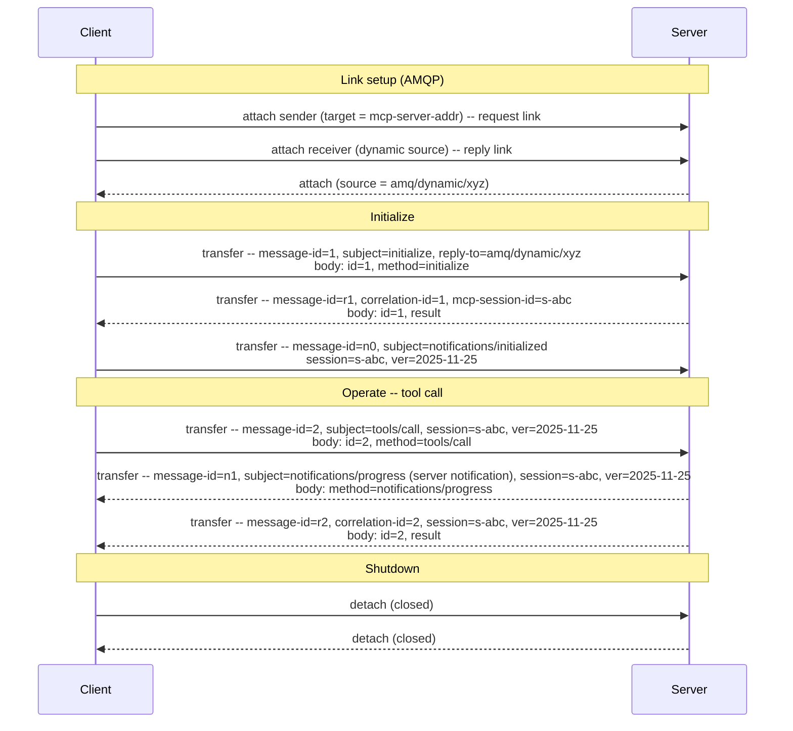

# MCP over AMQP 1.0 -- Binding Specification

## Working Draft 01

> **Status of this document.** This is an early working draft prepared for discussion with the OASIS AMQP Technical Committee. It is intentionally incomplete: it sketches the core of a binding to establish whether the overall approach is sound before detail is added. It is not for publication or implementation. Many details are deferred to later revisions.

## 1  Introduction

The Model Context Protocol (MCP) is an open protocol that connects LLM applications to external tools and data sources. It uses JSON-RPC 2.0 over a stateful connection between a client and a server, with capability negotiation and a defined session lifecycle. MCP currently defines two transports: stdio and Streamable HTTP.

This document defines a third option: a binding of MCP onto AMQP 1.0. A binding constrains only the application endpoints. It places no requirements on AMQP infrastructure, so any conforming AMQP 1.0 broker or router can carry MCP traffic without modification.

MCP's transports today assume a direct, client-initiated connection. AMQP opens MCP to the brokered and routed topologies that production messaging deployments already use, including paths that cross network boundaries and carry many sessions over one connection. MCP's semantics are unchanged; only the carriage is different. AMQP also offers mechanisms such as credit-based flow control and settlement that a later revision can map to MCP's needs; this draft does not yet specify that mapping.

This binding is intentionally step one, and it stands on its own. Because MCP carries its own correlation, cancellation, and discovery semantics in-band, today's unmodified AMQP is enough to run it; nothing here depends on future work. Later steps could go further, standardizing the patterns that application protocols over AMQP each tend to reinvent (for example progressive responses, cancellation, and capability discovery) as reusable extensions, and some may warrant changes to AMQP itself. Those are worth pursuing, but they belong to a separate discussion that follows this binding rather than gating it.

### 1.1  Normative References

- **[AMQP-v1.0]** *OASIS Advanced Message Queuing Protocol (AMQP) Version 1.0*.
- **[MCP]** *Model Context Protocol Specification*, version 2025-11-25. https://modelcontextprotocol.io
- **[JSON-RPC]** *JSON-RPC 2.0 Specification*. https://www.jsonrpc.org/specification

## 2  Definitions

- **MCP session** -- The application-level lifecycle between an MCP client and server, from `initialize` through operation to shutdown, as defined in [MCP]. This is distinct from an AMQP session.
- **AMQP session** -- The transport-level multiplexing unit (a channel pair on an AMQP connection) that carries link traffic, as defined in [AMQP-v1.0].
- **Request link** -- A unidirectional AMQP link carrying client-to-server traffic: the client's requests and notifications, and its responses to server-initiated requests.
- **Reply link** -- A unidirectional AMQP link carrying server-to-client traffic: responses, and the server-initiated requests and notifications that MCP permits.
- **Link pair** -- A request link and a reply link on the same AMQP session, together forming the bidirectional transport for one MCP session.

## 3  Overview

The premise of this binding is that MCP is a complete application protocol whose semantics live entirely at the endpoints. It defines its own session lifecycle, capability negotiation, message correlation (JSON-RPC `id`), and error reporting. An AMQP broker or router carrying MCP has no reason to inspect method names, capabilities, or session state; it simply delivers messages between endpoints, exactly as it would for any other payload. Where the binding surfaces identifiers such as the method name or the MCP session id into AMQP `properties` and `application-properties`, it does so only to enable optional routing and filtering by intermediaries that choose to use them; acting on these fields is never required, so the no-modification claim holds.

For that reason the correct instrument is a binding, not an AMQP extension and not a profile. There is no infrastructure-level behavior to add and no need to subset AMQP: MCP's lifecycle, correlation, and error semantics live in the JSON-RPC body, and the base AMQP primitives (the message sections, unidirectional links, dynamic termini) are enough to carry them. The rest of this document defines how MCP's JSON-RPC messages sit on those primitives.

One structural point drives the design. MCP is bidirectional: the client calls the server (tools, resources, prompts), and the server also calls the client (for example sampling, elicitation, and roots). AMQP links are unidirectional, so a single MCP session maps to a pair of links rather than one. This is the main way the binding goes beyond a purely client-initiated protocol.

## 4  Message Mapping

One JSON-RPC message maps to exactly one AMQP message. This holds for all three JSON-RPC message types that MCP uses: requests, responses, and notifications.

The JSON-RPC object itself is carried, unchanged, in a single AMQP `data` section with `content-type` set to `application/json`. The binding does not transform, wrap, or re-encode the JSON-RPC body; the body remains authoritative for method dispatch and correlation.

A small number of AMQP `properties` fields carry the routing and correlation information that AMQP infrastructure can act on without parsing the body:

| Field | Usage |
|-------|-------|
| `message-id` | Sender-assigned unique identifier, set on every message. On a request it is derived from the JSON-RPC `id`, so that the AMQP-level and JSON-RPC-level correlation cannot diverge. |
| `correlation-id` | On a response, the `message-id` of the request being answered. Because a request's `message-id` is derived from its JSON-RPC `id`, this value also equals the `id` the response echoes in its body. Absent on requests and notifications. |
| `reply-to` | On a request, the address to which the response is to be sent. Absent on notifications and responses. |
| `subject` | The JSON-RPC `method` name (for example `tools/call`). Advisory, to allow routing and filtering without body parsing; the body remains authoritative. |
| `content-type` | `application/json`. |

Deriving a request's `message-id` from its JSON-RPC `id` keeps the two correlation layers in lockstep: an intermediary can correlate on the AMQP `correlation-id` while an endpoint correlates on the JSON-RPC `id`, and the two never disagree. The body remains authoritative; the `properties` fields carry the same correlation into a form infrastructure can act on without decoding it.

Two identifiers travel in the `application-properties` section so that intermediaries and endpoints can associate a message with its MCP session without decoding the body:

| Key | Usage |
|-----|-------|
| `mcp-session-id` | The MCP session identifier, analogous to the `MCP-Session-Id` header in Streamable HTTP. Established during initialization and present on subsequent messages. |
| `mcp-protocol-version` | The negotiated MCP protocol version. |

The remaining AMQP sections are unconstrained by this binding.

## 5  Link Topology

Because AMQP links are unidirectional and MCP is bidirectional, one MCP session uses a **link pair** on a shared AMQP session.

In a direct client-server connection, the client attaches both links: a sending link whose target is the server's address (the **request link**), and a receiving link with a dynamic source terminus (the **reply link**). The dynamic flag instructs the peer to allocate a unique address for the reply link; this is the address at which the client receives everything the server sends back. The client also places that address in the `reply-to` field of its `initialize` request so the server learns it directly.

The server sends all of its traffic on the reply link to that dynamic address: responses to client requests, and its own server-initiated requests (for example sampling, elicitation, and roots) and notifications. Server-initiated requests carry `reply-to` set to the server's own request address, and the client answers them on the existing request link. No additional links are created per message or per server request.

When a server handles many clients, it sends to each client's distinct reply address. In a brokered topology, the client and server each attach their links to the intermediary rather than to each other, and multiple clients may share a single queue backing the server's request address; the `mcp-session-id` distinguishes which MCP session a given message belongs to.

## 6  Session Lifecycle

MCP's three-phase lifecycle rides on top of AMQP link establishment. The two notions of session remain distinct: AMQP link attach provides transport-level setup, while MCP's `initialize` handshake provides application-level capability negotiation.

**Initialization.** The client attaches the link pair, then sends the `initialize` request on the request link with its dynamic reply address in `reply-to`. The server replies on the reply link, and the response carries `mcp-session-id` in `application-properties`. The client then sends the `notifications/initialized` notification, and both peers enter the operation phase.

**Operation.** The peers exchange requests, responses, and notifications per the negotiated capabilities. Every message after initialization carries `mcp-session-id` and `mcp-protocol-version`. AMQP guarantees ordering per link, so a progress notification sent ahead of a response also arrives ahead of it, matching MCP's expectation.

**Shutdown.** Detaching the link pair with the `closed` flag set terminates the MCP session. A peer that observes its counterpart detach with `closed` set treats the MCP session as ended and releases associated state. A non-closing detach (`closed` unset) suspends the link and does not end the MCP session. Abrupt connection loss is equivalent to session termination.

## Appendix A  Example Exchange (Informative)

A minimal session: link setup, initialize, one tool call with a progress notification, and shutdown. Only the fields relevant to the binding are shown.

Client-to-server transfers travel on the request link; server-to-client transfers travel on the reply link at the client's dynamic address.
