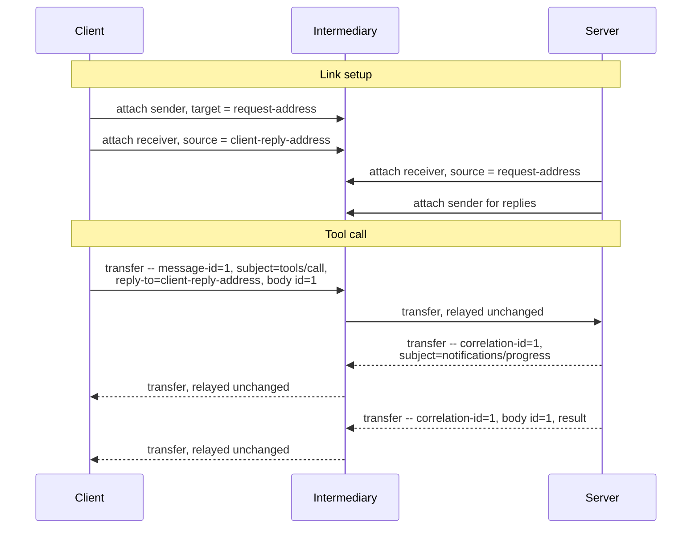

# MCP over AMQP 1.0 -- Binding Specification

## Working Draft

> **Status of this document.** This is an early working draft prepared for discussion with the OASIS
> AMQP Technical Committee. It is intentionally incomplete: it sketches the core of a binding to
> establish whether the overall approach is sound before detail is added. It is not for publication
> or implementation. Many details are deferred to later revisions.
>
> **Revision.** 2026-08-08. Revisions are listed in Appendix B, one line each, and the commit
> history of this file carries the detail. Working Draft numbering is reserved for drafts submitted
> for public review.

## 1  Introduction

The Model Context Protocol (MCP) is an open protocol that connects LLM applications to external
tools and data sources. It uses JSON-RPC 2.0 [JSON-RPC], and as of version 2026-07-28 it is
stateless: every request carries the protocol version and client capabilities it is made
under [MCP]. MCP currently defines two transports: stdio and Streamable HTTP.

This document defines a third option: a binding of MCP onto AMQP 1.0 [AMQP-v1.0]. A binding
constrains only the application endpoints, so any conforming AMQP 1.0 broker or router carries MCP
traffic as it stands.

MCP's transports today assume a direct, client-initiated connection. AMQP opens MCP to the brokered
and routed topologies that production messaging deployments already use, including paths that cross
network boundaries and carry many clients over one connection. Statelessness makes those topologies
a natural fit: any request can be served by any server instance, so a queue with competing consumers
behind a single address is an ordinary MCP deployment.

A binding is the right instrument, and [MCP] scopes one the same way: how messages are framed and
delivered, how request metadata is carried, and how cancellation and termination are signaled.
MCP's semantics live entirely at its endpoints, in its own correlation (JSON-RPC `id`), its own
error reporting, and the version and capability context each request carries, so an intermediary
relays MCP as it would any other payload. The message sections, links, and the `properties` fields
used for request/reply correlation carry MCP as they stand.

This binding is step one and stands on its own. Later steps could standardize the patterns that
application protocols over AMQP each tend to reinvent, as reusable extensions, and some may warrant
changes to AMQP itself. Those belong to a separate discussion that follows this binding.

Deliberately out of scope for this draft: flow control and link credit, settlement policy,
addressing conventions, error taxonomy, and security beyond the SASL and TLS mechanisms AMQP already
provides.

### 1.1  Normative References

- **[AMQP-v1.0]** *OASIS Advanced Message Queuing Protocol (AMQP) Version 1.0*. OASIS Standard,
  29 October 2012.
- **[MCP]** *Model Context Protocol Specification*, version 2026-07-28.
  https://modelcontextprotocol.io
- **[JSON-RPC]** *JSON-RPC 2.0 Specification*. https://www.jsonrpc.org/specification

## 2  Definitions

- **Request link** -- An AMQP link carrying client-to-server traffic: the client's requests and
  notifications.
- **Reply link** -- An AMQP link carrying server-to-client traffic: responses to the client's
  requests, and the server notifications MCP defines.
- **Reply address** -- The AMQP address at which a client receives what a server sends back to it,
  carried in the `reply-to` field of each request.

## 3  Overview

MCP traffic runs in two directions [MCP]: client-sent requests and notifications to the server,
and server-sent responses and notifications to the client. A client therefore uses two links:
a request link on which it sends, and a reply link at which it receives everything the server
sends back.

One JSON-RPC message maps to exactly one AMQP message, carried unchanged in a single `data` section,
and the body remains authoritative for method dispatch and correlation. The binding's wire contract
sits in AMQP `properties`: each request carries a `message-id` and the `reply-to` address at which
its sender receives replies, and everything answering that request carries `correlation-id` set to
that `message-id` (§4).

Because that contract is per-message, one reply address serves however many requests a client has in
flight, and any server instance can answer any request. The same two links carry a client attached
directly to a server and a client attached to a broker or router fronting a queue that many clients
share and many server instances serve (§5).

A client issues requests as soon as its links are attached, since each request carries the protocol
version and capabilities it is made under. Detaching, or loss of the connection, ends the
transport (§5).

## 4  Message Mapping

One JSON-RPC message, whether request, response, or notification, maps to exactly one AMQP message.
The JSON-RPC object is carried unchanged in a single `data` section with `content-type` set to
`application/json`, and the body remains authoritative for method dispatch and correlation.

The request/response contract is the whole of what this binding requires of the wire, and it is
stated as AMQP `properties` fields, which brokers relay without interpreting:

| Field | Usage |
|-------|-------|
| `message-id` | MUST be set on every request, to a value the client has not used for another request on the same reply address. |
| `reply-to` | MUST be set on every request, to the reply address at which the client receives what the server sends back. |
| `correlation-id` | MUST be set on every message a responder sends in answer to a request, to the value of that request's `message-id` as received, unaltered in type or representation. Absent on requests. |
| `subject` | The JSON-RPC `method` name (for example `tools/call`). Advisory, to allow routing and filtering without body parsing; the body remains authoritative. |
| `content-type` | `application/json`. |

The two correlation layers stay independent -- AMQP's `message-id` and `correlation-id`, and the
JSON-RPC `id` in the body -- and both are carried end to end.

A client abandons an in-flight request by sending `notifications/cancelled` on its request link,
referencing the request's JSON-RPC `id`; this is the cancellation pattern [MCP] requires each
binding to define. A server sends that notification to a client's reply address only to tear down a
subscription stream (§5), which is the sole purpose [MCP] permits it.

The remaining AMQP sections are unconstrained by this binding.

## 5  Link Topology

A client sends on a link targeting the server's request address and receives at its own reply
address. A queue backing the request address may be shared by many clients and served by many
server instances: the per-request `reply-to` and `correlation-id` return each response to the
client that issued it, with no shared state at the intermediary.

The reply address is an AMQP address whose format the container determines, and this binding does
not constrain how a client obtains one. It may be pre-provisioned, or declared by the client over
whatever management interface the container offers, or allocated by the container as a dynamic
terminus where one is supported. Containers differ in which of these they offer.

A responder directs each reply to the address in the request's `reply-to`. One reply address serves
a client for as many requests as it chooses to have in flight, because responses are demultiplexed
on `correlation-id`.

This holds where one request yields many messages. A `subscriptions/listen` request receives its
stream of notifications, and the result that closes the stream, at the same reply address, in the
order the server sent them.

Detaching with the `closed` flag set, or loss of the connection, ends the transport. Requests in
flight at that point are lost, and the client reissues them under a new JSON-RPC `id`.

## 6  Conformance

A **requesting container** conforms to this binding if it sets `reply-to` on every request to an
address at which it can receive messages, sets `message-id` to a value it has not used for another
request on that address, and correlates each reply it receives to a request on `correlation-id`.

A **responding container** conforms to this binding if it sets `correlation-id` on every message it
sends in answer to a request, to that request's `message-id`, and directs each of them to the
address in the request's `reply-to`.

Both roles carry each JSON-RPC message unchanged in a single `data` section, as §4 defines,
and preserve what [MCP] requires of any custom transport: "the JSON-RPC message format,
the [message patterns], and the per-request metadata model". The connection establishment,
message framing, and cancellation patterns that [MCP] asks a custom transport to document are
defined in §4 and §5.

## Appendix A  Example Exchange (Informative)

A minimal exchange through an intermediary: link setup and one tool call with a progress
notification. Addresses are shown as placeholders; their format is container-specific. Only the
fields relevant to the binding are shown.

The intermediary relays each transfer unchanged. Delete it and the direct case remains, with the
client's links attached to the server and the same `properties` carrying the exchange.

## Appendix B  Revision History (Informative)

Newest first. One line per revision; the commit history of this file carries the detail.

| Date | Change |
|------|--------|
| 2026-08-08 | Track [MCP] 2026-07-28, which makes MCP stateless, and simplify the request/response mechanism to a contract stated in message `properties`. |
| 2026-07-28 | First draft submitted to the Technical Committee for discussion. |
