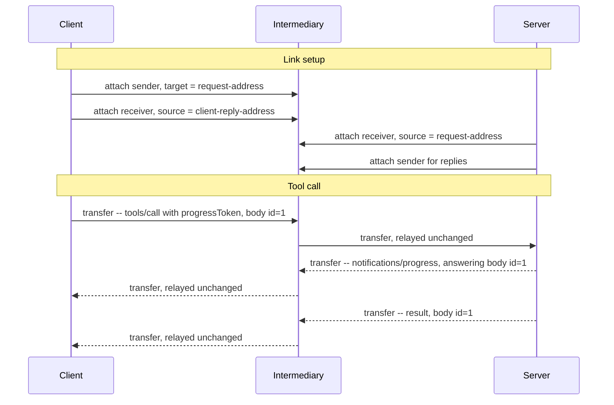

# MCP over AMQP 1.0 -- Binding Specification

## Working Draft

> **Status of this document.** This is an early working draft prepared for discussion with the OASIS
> AMQP Technical Committee. It is intentionally incomplete: it sketches the core of a binding, and
> detail arrives over later revisions. It is not for publication or implementation.
>
> **Revision.** 2026-09-17. Revisions are listed in Appendix B, one line each, and the commit
> history of this file carries the detail. Working Draft numbering is reserved for drafts submitted
> for public review.

## 1  Introduction

The Model Context Protocol (MCP) is an open protocol that connects LLM applications to external
tools and data sources. It uses JSON-RPC 2.0 [JSON-RPC], and as of version 2026-07-28 it is
stateless: every request carries the protocol version and client capabilities it is made
under [MCP]. MCP currently defines two transports: stdio and Streamable HTTP.

This document defines a binding of MCP onto AMQP 1.0 [AMQP-v1.0]. A binding
constrains only the application endpoints, so any conforming AMQP 1.0 broker or router carries MCP
traffic as it stands.

How a JSON-RPC message is framed on AMQP, and how a request is correlated with the messages that
answer it, is defined by the binding of JSON-RPC 2.0 onto AMQP 1.0 [JSONRPC-AMQP]. This document
layers on that binding and defines only what MCP adds to it: the traffic MCP generates in each
direction, the deployments its statelessness admits, and how a request is abandoned.

MCP's transports today assume a direct, client-initiated connection. AMQP opens MCP to the brokered
and routed topologies that production messaging deployments already use, including paths that cross
network boundaries and carry many clients over one connection. Statelessness makes those topologies
a natural fit: any request can be served by any server instance, so a queue with competing consumers
behind a single address is an ordinary MCP deployment.

A binding is the right instrument, and [MCP] scopes one the same way: connection establishment,
message framing, and cancellation. MCP's semantics live entirely at its endpoints, in its own
correlation (JSON-RPC `id`), its own error reporting, and the version and capability context each
request carries, so an intermediary relays MCP as it would any other payload.

The patterns that application protocols over AMQP each tend to reinvent are better standardized
once than restated per protocol, and [JSONRPC-AMQP] does that for message exchange. Further
steps may warrant changes to AMQP itself, and belong to a separate discussion.

Deliberately out of scope for this draft: flow control and link credit, settlement policy,
addressing conventions, error taxonomy, and security beyond the SASL and TLS mechanisms AMQP already
provides.

### 1.1  Normative References

- **[AMQP-v1.0]** *OASIS Advanced Message Queuing Protocol (AMQP) Version 1.0*. OASIS Standard,
  29 October 2012.
- **[MCP]** *Model Context Protocol Specification*, version 2026-07-28.
  https://modelcontextprotocol.io
- **[JSON-RPC]** *JSON-RPC 2.0 Specification*. https://www.jsonrpc.org/specification
- **[JSONRPC-AMQP]** *JSON-RPC 2.0 over AMQP 1.0 -- Binding Specification Version 1.0*. Committee
  Specification NN, DD Month YYYY.
  https://docs.oasis-open.org/amqp/jsonrpc-amqp/v1.0/csNN/jsonrpc-amqp-v1.0-csNN.html

## 2  Definitions

This binding coins no terms of its own. Its terms are defined in [JSONRPC-AMQP] §2.

## 3  Overview

Every MCP interaction begins with the client [MCP]: the client sends requests and notifications, and
the server answers each request with a response, optionally preceded by notifications scoped to that
request. A client uses two links: a request link on which it sends, and a reply link at which it
receives everything the server sends back.

The framing of each JSON-RPC message on AMQP, and the fields that correlate a request with
everything answering it, are as [JSONRPC-AMQP] defines.

Because correlation travels with each message rather than being held at the intermediary, one reply
address serves however many requests a client has in flight, and any server instance can answer any
request. The same two links carry a client attached directly to a server and a client attached to an
intermediary fronting a queue that many clients share and many server instances serve (§5).

A client issues requests as soon as its links are attached, since each request carries the protocol
version and capabilities it is made under. Detaching, or loss of the connection, ends the transport
as [JSONRPC-AMQP] §5 defines.

## 4  MCP Message Exchange

Each MCP message is one JSON-RPC message, framed on AMQP and correlated with everything answering it
as [JSONRPC-AMQP] defines. This binding adds no wire fields of its own and leaves the
remaining AMQP sections unconstrained.

A client abandons an in-flight request by sending `notifications/cancelled` on its request link,
referencing the request's JSON-RPC `id`. A server MUST send that notification to a client's reply
address when it tears down a subscription stream (§5), and MUST NOT send it for any other purpose.
Where server instances share one request address (§5), [JSONRPC-AMQP] delivers this notification to
an arbitrary instance; no field of that binding routes it to the instance holding the request.
Delivery is therefore best-effort; [MCP] specifies the same for cancellation.

## 5  Link Topology

A client sends on a link targeting the server's request address and receives at its own reply
address. A queue backing the request address may be shared by many clients and served by many
server instances: the per-request correlation [JSONRPC-AMQP] defines returns each response to
the client that issued it, with no shared state at the intermediary.

A request may be answered by more than one message, and every such message arrives at the request's
reply address.

## 6  Conformance

A container in either role conforms to [JSONRPC-AMQP] for message framing and request/response
correlation, and preserves what [MCP] requires of any custom transport: "the JSON-RPC message
format, the [message patterns], and the per-request metadata model".

A **requesting container** conforms to this binding if it abandons an in-flight request only by
sending `notifications/cancelled` as §4 defines.

A **responding container** conforms to this binding if every message it sends in answer to a request
counts as a response to it for framing and correlation, and if it sends `notifications/cancelled`
to a requesting container only to tear down a subscription stream.

The connection establishment and cancellation patterns that [MCP] asks a custom transport to
document are defined in §4 and §5; message framing is defined by [JSONRPC-AMQP].

## Appendix A  Example Exchange (Informative)

A minimal exchange through an intermediary: link setup and one tool call with a progress
notification. Addresses are shown as placeholders; their format is container-specific. The AMQP
fields that frame and correlate each transfer are as [JSONRPC-AMQP] defines and are omitted
here; each transfer is labeled with the MCP message it carries.

The intermediary relays each transfer unchanged. Delete it and the direct case remains, with the
client's links attached to the server and the exchange otherwise unchanged.

## Appendix B  Revision History (Informative)

Newest first. One line per revision; the commit history of this file carries the detail.

| Date | Change |
|------|--------|
| 2026-09-17 | Correct statements about [MCP] that the specification does not support: stop restating the subscription stream in §5 and §6, which required at MUST level a closing result [MCP] makes a SHOULD; leave transport termination to [JSONRPC-AMQP], whose §5 it contradicted; state what [MCP] asks a custom transport to document, and the obligation on a server tearing down a stream; and ground §3's two-link model on [MCP]'s interaction rule. |
| 2026-09-01 | Cite [JSONRPC-AMQP] as a normative reference and replace every bare mention of it with the citation anchor, so conformance to this document names the base contract it is defined against. |
| 2026-08-24 | Layer on the separate binding of JSON-RPC 2.0 onto AMQP 1.0: remove the message framing and request/response correlation this document previously defined, leaving only what MCP adds. Drop the end-to-end ordering claim from the subscription stream. |
| 2026-08-08 | Track [MCP] 2026-07-28, which makes MCP stateless, and simplify the request/response mechanism to a contract stated in message `properties`. |
| 2026-07-28 | First draft submitted to the Technical Committee for discussion. |
