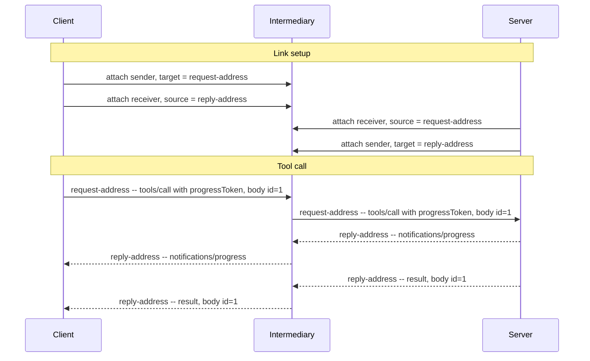

# MCP over AMQP 1.0 -- Binding Specification

## Working Draft

> **Status of this document.** This is a working draft that is not for publication or
> implementation.
>
> **Revision.** 2026-09-24. Working Draft numbering is reserved for drafts submitted for public
> review.

## 1  Introduction

The Model Context Protocol (MCP) is an open protocol that connects LLM applications to external
tools and data sources. As of version 2026-07-28 it uses JSON-RPC 2.0 [JSON-RPC] and is stateless.
MCP currently defines two transports: stdio and Streamable HTTP.

This binding specification defines a binding of MCP onto AMQP 1.0 [AMQP-v1.0]. It defines the
application endpoints so any conforming AMQP 1.0 broker or router can be used as an MCP transport
without modification.

A separate binding specification for JSON-RPC 2.0 on AMQP 1.0 [JSONRPC-AMQP] defines how a JSON-RPC
message is framed on AMQP and how a request is correlated with a response. This binding
specification layers on that binding and defines only what MCP adds to it.

MCP's transports today assume a direct, Client-initiated connection. AMQP opens MCP to the brokered
and routed topologies that production messaging deployments already use, including paths that cross
network boundaries and carry many Clients over one connection. Any request can be served by any
Server instance, so a node with competing consumers behind a single address is an ordinary MCP
deployment.

This binding specification deliberately does not address flow control and link credit, settlement
policy, addressing conventions, error taxonomy, and security beyond the SASL and TLS mechanisms AMQP
already provides.

### 1.1  Normative References

- **[AMQP-v1.0]** *OASIS Advanced Message Queuing Protocol (AMQP) Version 1.0*. OASIS Standard, 29
  October 2012.
- **[MCP]** *Model Context Protocol Specification*, version 2026-07-28.
  https://modelcontextprotocol.io
- **[JSON-RPC]** *JSON-RPC 2.0 Specification*. https://www.jsonrpc.org/specification
- **[JSONRPC-AMQP]** *JSON-RPC 2.0 over AMQP 1.0 -- Binding Specification Version 1.0*. Committee
  Specification NN, DD Month YYYY.
  https://docs.oasis-open.org/amqp/jsonrpc-amqp/v1.0/csNN/jsonrpc-amqp-v1.0-csNN.html

## 2  Definitions

This binding specification uses the terms defined in [JSONRPC-AMQP] §2.

- **Client** -- The Client sends JSON-RPC requests and notifications, as defined by [MCP]. It is the
  Requester of [JSONRPC-AMQP].
- **Server** -- The Server answers each request with a JSON-RPC response (a result or an error),
  optionally preceded by notifications scoped to that request, as defined by [MCP]. It is the
  Responder of [JSONRPC-AMQP].

## 3  Overview

Every MCP interaction begins with the Client [MCP]: the Client sends requests and notifications, and
the Server answers each request with a response, optionally preceded by notifications scoped to that
request. A Client uses two links: a Request Link for sending requests and notifications, and a Reply
Link for receiving responses and notifications. A Server uses the inverse links: a Request Link for
receiving requests and notifications, and a Reply Link for sending responses and notifications.

The body of each JSON-RPC message is an MCP message defined by [MCP]. This binding specification
does not add fields or modify its contents. The framing of JSON-RPC messages on AMQP is defined by
[JSONRPC-AMQP].

This binding specification applies only to MCP version 2026-07-28.

## 4  MCP Message Exchange

[MCP] composes requests, responses, and notifications into three patterns: request and response,
multi round-trip requests, and subscribe and notify. In each, the Server may send more than one
message in response to a request, and it sends each of them to the request's Reply Address with the
request's `message-id` as its `correlation-id` [JSONRPC-AMQP].

### 4.1  Request and Response

The Client sends a request with the AMQP properties defined by [JSONRPC-AMQP], including
`message-id` and `reply-to`. Before the Server sends the response, it may send notifications such as
progress notifications. The Server sends the notifications and the response with the same
`correlation-id`.

### 4.2  Multi Round-Trip Requests

When a Server needs Client input to complete a request, it sends a response to the Reply Address
with an `InputRequiredResult`, and the Client retries by sending the original `params` together with
`inputResponses` [MCP]. The retry is a new JSON-RPC request that is not correlated with the original
request. It has a new `id`, so [JSONRPC-AMQP] binds it as a new request, with a new `message-id`. If
the Request Address is served by multiple Server instances, the new request can be served by any
instance since the retry carries the original `params`, any `inputResponses`, and the `requestState`
the Server returned [MCP].

### 4.3  Subscribe and Notify

When a Client sends a `subscriptions/listen` request, the Server responds with a long-lived stream
of notifications [MCP]. The Server sends every notification on the stream to the same Reply Address
with the same `correlation-id`, and retains the request's `message-id` and `reply-to` for as long as
the stream stays open [JSONRPC-AMQP].

## 5  Link Topology

A Client sends messages to a Request Address and receives messages on its Reply Address. A node
backing the Request Address may be shared by many Clients and served by many Server instances: using
the per-request correlation [JSONRPC-AMQP] defines, a Server returns each response to the Client
that issued the request, with no shared state at the intermediary.

## 6  Cancellation

Unlike stdio and Streamable HTTP, AMQP does not cancel a request when a connection fails. If a
Client's Reply Link is lost and the Reply Address remains, the Client may recreate the link and
continue to receive responses and notifications from the Server.

A Client MUST limit how long it waits for the response to every request that it sends, and MUST
cancel the request once that time is exceeded. A Client cancels a request by sending
`notifications/cancelled`, with `requestId` set to the request's `id`, on its Request Link [MCP]. A
Client may send a new request to retry. When multiple Server instances compete for messages on a
Request Address, the intermediary may deliver a `notifications/cancelled` to an instance other than
the one processing the request, so cancellation is best-effort.

A Server MUST limit how long it keeps a subscription stream open. Once that time is exceeded, it
MUST end the stream, and SHOULD do so by sending the response to the `subscriptions/listen` request,
a result with `resultType` set to `complete`, to the request's Reply Address. If a Server cannot
deliver to a request's Reply Address, it SHOULD stop processing the request.

## 7  Ordering

[MCP] requires a Server to send `notifications/subscriptions/acknowledged` as the first message on a
`subscriptions/listen` stream, and not to send any notification on the stream before it. AMQP
guarantees the order of messages within a link, so a Server MUST send all of its messages for a
request on one Reply Link, in the order [MCP] requires. An intermediary may still deliver them to
the Client in a different order [JSONRPC-AMQP].

## 8  Authorization

This binding specification uses the SASL and TLS mechanisms defined by [AMQP-v1.0].

## Appendix A  Example Exchange (Informative)

The following example is a simple exchange through an intermediary consisting of a link setup, one
tool call, a progress notification, and a result.

The intermediary relays each transfer without modifying the JSON-RPC message.

## Appendix B  Revision History (Informative)

Newest first. One line per revision; the commit history of this file carries the detail.

| Date | Change |
|------|--------|
| 2026-09-24 | Describe the [MCP] message patterns; add Cancellation, Ordering and Authorization; map Client and Server to the [JSONRPC-AMQP] roles; remove the Conformance section. |
| 2026-09-17 | Correct statements about [MCP]: drop a MUST-level closing result [MCP] makes a SHOULD; leave transport termination to [JSONRPC-AMQP]; ground the two-link model on [MCP]. |
| 2026-09-01 | Cite [JSONRPC-AMQP] as a normative reference and use its citation anchor throughout. |
| 2026-08-24 | Layer on the JSON-RPC 2.0 over AMQP 1.0 binding, removing the framing and correlation defined here; drop the end-to-end ordering claim for subscription streams. |
| 2026-08-08 | Track [MCP] 2026-07-28, which makes MCP stateless, and simplify the request/response mechanism to a contract stated in message `properties`. |
| 2026-07-28 | First draft submitted to the Technical Committee for discussion. |
