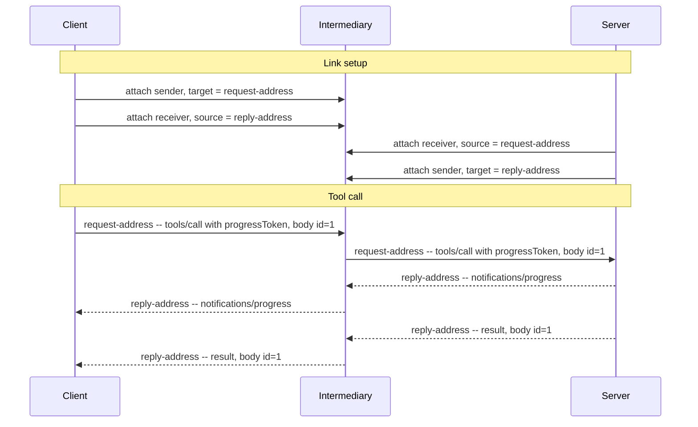

# MCP over AMQP 1.0 -- Binding Specification Version 1.0

## Working Draft 01

## 08 October 2026

Standards Track Work Product. Prepared for a ballot to approve Committee Specification Draft 01
and authorize its first 30-day public review; neither approval nor public review has occurred.

### This Stage

Not yet published. Proposed CSD01 locations, subject to OASIS registration and confirmation:

- Markdown (proposed authoritative format):
  `https://docs.oasis-open.org/amqp/mcp-amqp/v1.0/csd01/mcp-amqp-v1.0-csd01.md`
- HTML: `https://docs.oasis-open.org/amqp/mcp-amqp/v1.0/csd01/mcp-amqp-v1.0-csd01.html`
- PDF: `https://docs.oasis-open.org/amqp/mcp-amqp/v1.0/csd01/mcp-amqp-v1.0-csd01.pdf`

### Previous Stage

N/A. This work product has no approved publication identified in this draft.

### Latest Stage

Not yet published. Proposed latest-stage locations, subject to OASIS confirmation:

- Markdown: `https://docs.oasis-open.org/amqp/mcp-amqp/v1.0/mcp-amqp-v1.0.md`
- HTML: `https://docs.oasis-open.org/amqp/mcp-amqp/v1.0/mcp-amqp-v1.0.html`
- PDF: `https://docs.oasis-open.org/amqp/mcp-amqp/v1.0/mcp-amqp-v1.0.pdf`

### Technical Committee

[OASIS Advanced Message Queuing Protocol (AMQP) TC](https://www.oasis-open.org/committees/amqp/)

### Chairs

- Rob Godfrey, IBM
- Clemens Vasters (<clemensv@microsoft.com>), Microsoft

### Editors

- Stefan Moser (<stefamos@amazon.com>), AWS
- Vignesh Selvam (<vigselvm@amazon.com>), AWS

### Abstract

This specification defines an AMQP 1.0 transport binding for Model Context Protocol version
2026-07-28. It builds on the JSON-RPC 2.0 over AMQP 1.0 binding and defines MCP message exchange,
link topology, cancellation, and ordering for direct, brokered, and routed connections.

### Citation Format

**[MCP-AMQP]** *MCP over AMQP 1.0 -- Binding Specification Version 1.0*, OASIS Advanced Message
Queuing Protocol (AMQP) TC, Working Draft 01, 08 October 2026. [Online]. Available:
[TC repository](https://github.com/oasis-tcs/amqp-specs/tree/master/mcp).

### Related Work

This document is related to *JSON-RPC 2.0 over AMQP 1.0 -- Binding Specification Version 1.0*
[JSONRPC-AMQP], on which it builds.

## License, Document Status, and Notices

Copyright © OASIS Open 2026. All Rights Reserved. For license and copyright information and
complete status, see [Annex A](#annex-a-license-document-status-and-notices).

## Table of Contents

- [1 Scope](#1-scope)
- [2 Definitions](#2-definitions)
- [3 Document Conventions](#3-document-conventions)
- [4 Introduction](#4-introduction)
- [5 Overview](#5-overview)
- [6 MCP Message Exchange](#6-mcp-message-exchange)
- [7 Link Topology](#7-link-topology)
- [8 Cancellation](#8-cancellation)
- [9 Ordering](#9-ordering)
- [10 Safety, Security, and Data Protection Considerations](#10-safety-security-and-data-protection-considerations)
- [11 Conformance](#11-conformance)
- [Annex A License, Document Status and Notices](#annex-a-license-document-status-and-notices)
- [Annex B References](#annex-b-references)
- [Appendix 1 Acknowledgments](#appendix-1-acknowledgments)
- [Appendix 2 Changes From Previous Version](#appendix-2-changes-from-previous-version)
- [Appendix 3 Example Exchange](#appendix-3-example-exchange)

## 1 Scope

This binding specification defines a binding of MCP onto AMQP 1.0 [AMQP-v1.0]. It defines the
application endpoints so any conforming AMQP 1.0 broker or router can be used as an MCP transport
without modification.

A separate binding specification for JSON-RPC 2.0 on AMQP 1.0 [JSONRPC-AMQP] defines how a JSON-RPC
message is framed on AMQP and how a request is correlated with a response. This binding
specification layers on that binding and defines only what MCP adds to it.

This binding specification deliberately does not address flow control and link credit, settlement
policy, addressing conventions, error taxonomy, and security beyond the SASL and TLS mechanisms AMQP
already provides.

This binding specification applies only to MCP version 2026-07-28.

## 2 Definitions

This binding specification uses the terms defined in [JSONRPC-AMQP] §2.

- **Client** -- The Client sends JSON-RPC requests and notifications, as defined by [MCP]. It is the
  Requester of [JSONRPC-AMQP].
- **Server** -- The Server answers each request with a JSON-RPC response (a result or an error),
  optionally preceded by notifications scoped to that request, as defined by [MCP]. It is the
  Responder of [JSONRPC-AMQP].

## 3 Document Conventions

### 3.1 Key Words

The key words "MUST", "MUST NOT", "REQUIRED", "SHALL", "SHALL NOT", "SHOULD", "SHOULD NOT",
"RECOMMENDED", "NOT RECOMMENDED", "MAY", and "OPTIONAL" in this document are to be interpreted
as described in BCP 14 [RFC2119] [RFC8174] when, and only when, they appear in all capitals,
as shown here.

### 3.2 Typographical Conventions

Monospace text identifies AMQP fields, MCP methods, JSON members, literal values, and protocol
identifiers. References in square brackets identify entries in Annex B. Section references
identify sections of this document unless a referenced document is named explicitly.

## 4 Introduction

The Model Context Protocol (MCP) is an open protocol that connects LLM applications to external
tools and data sources. As of version 2026-07-28 it uses JSON-RPC 2.0 [JSON-RPC] and is stateless.
MCP currently defines two transports: stdio and Streamable HTTP.

MCP's transports today assume a direct, Client-initiated connection. AMQP opens MCP to the brokered
and routed topologies that production messaging deployments already use, including paths that cross
network boundaries and carry many Clients over one connection. Any request can be served by any
Server instance, so a node with competing consumers behind a single address is an ordinary MCP
deployment.

### 4.1 Changes From the Previous Version

Changes and revision history are recorded in Appendix 2.

## 5 Overview

Every MCP interaction begins with the Client [MCP]: the Client sends requests and notifications, and
the Server answers each request with a response, optionally preceded by notifications scoped to that
request. A Client uses two links: a Request Link for sending requests and notifications, and a Reply
Link for receiving responses and notifications. A Server uses the inverse links: a Request Link for
receiving requests and notifications, and a Reply Link for sending responses and notifications.

The body of each JSON-RPC message is an MCP message defined by [MCP]. This binding specification
does not add fields or modify its contents. The framing of JSON-RPC messages on AMQP is defined by
[JSONRPC-AMQP].

This binding specification applies only to MCP version 2026-07-28.

## 6 MCP Message Exchange

[MCP] composes requests, responses, and notifications into three patterns: request and response,
multi round-trip requests, and subscribe and notify. In each, the Server may send more than one
message in response to a request, and it sends each of them to the request's Reply Address with the
request's `message-id` as its `correlation-id` [JSONRPC-AMQP].

### 6.1 Request and Response

The Client sends a request with the AMQP properties defined by [JSONRPC-AMQP], including
`message-id` and `reply-to`. Before the Server sends the response, it may send notifications such as
progress notifications. The Server sends the notifications and the response with the same
`correlation-id`.

### 6.2 Multi Round-Trip Requests

When a Server needs Client input to complete a request, it sends a response to the Reply Address
with an `InputRequiredResult`, and the Client retries by sending the original `params` together with
`inputResponses` [MCP]. The retry is a new JSON-RPC request that is not correlated with the original
request. It has a new `id`, so [JSONRPC-AMQP] binds it as a new request, with a new `message-id`. If
the Request Address is served by multiple Server instances, the new request can be served by any
instance since the retry carries the original `params`, any `inputResponses`, and the `requestState`
the Server returned [MCP].

### 6.3 Subscribe and Notify

When a Client sends a `subscriptions/listen` request, the Server responds with a long-lived stream
of notifications [MCP]. The Server sends every notification on the stream to the same Reply Address
with the same `correlation-id`, and retains the request's `message-id` and `reply-to` for as long as
the stream stays open [JSONRPC-AMQP].

## 7 Link Topology

A Client sends messages to a Request Address and receives messages on its Reply Address. A node
backing the Request Address may be shared by many Clients and served by many Server instances: using
the per-request correlation [JSONRPC-AMQP] defines, a Server returns each response to the Client
that issued the request, with no shared state at the intermediary.

## 8 Cancellation

Unlike stdio and Streamable HTTP, AMQP does not cancel a request when a connection fails. If a
Client's Reply Link is lost and the Reply Address remains, the Client may recreate the link and
continue to receive responses and notifications from the Server.

A Client MUST limit how long it waits for the response to every request that it sends, and MUST
cancel the request once that time is exceeded. A Client cancels a request by sending
`notifications/cancelled`, with `requestId` set to the request's `id`, on its Request Link [MCP]. A
Client may send a new request to retry. When multiple Server instances compete for messages on a
Request Address, the intermediary may deliver a `notifications/cancelled` to an instance other than
the one processing the request, so cancellation is best-effort.

A Server MUST limit how long it keeps a subscription stream open. Once that time is exceeded, it
MUST end the stream, and SHOULD do so by sending the response to the `subscriptions/listen` request,
a result with `resultType` set to `complete`, to the request's Reply Address. If a Server cannot
deliver to a request's Reply Address, it SHOULD stop processing the request.

## 9 Ordering

[MCP] requires a Server to send `notifications/subscriptions/acknowledged` as the first message on a
`subscriptions/listen` stream, and not to send any notification on the stream before it. AMQP
guarantees the order of messages within a link, so a Server MUST send all of its messages for a
request on one Reply Link, in the order [MCP] requires. An intermediary may still deliver them to
the Client in a different order [JSONRPC-AMQP].

## 10 Safety, Security, and Data Protection Considerations

### 10.1 Security Considerations

This binding specification uses the SASL and TLS mechanisms defined by [AMQP-v1.0].

### 10.2 Safety and Data Protection Considerations

This binding defines no additional safety or data protection mechanism. Its security scope is
stated in §1; application protocols and deployments determine the treatment of their payloads.

## 11 Conformance

These numbered clauses summarize requirements already stated in this binding and in
[JSONRPC-AMQP]. They do not introduce additional wire-protocol requirements. Requirements and
recommendations retain their BCP 14 meanings as defined in §3.1.

### 11.1 Client Conformance

A Client conforms to this binding if it:

1. satisfies the requesting-container conformance requirements of [JSONRPC-AMQP];
2. carries MCP version 2026-07-28 messages as required by §1 and §5;
3. uses a Request Link to send requests and notifications and a Reply Link to receive responses
   and notifications, as described in §5 and §7;
4. limits how long it waits for each request's response and cancels a request once that limit is
   exceeded, as required by §8.

### 11.2 Server Conformance

A Server conforms to this binding if it:

1. satisfies the responding-container conformance requirements of [JSONRPC-AMQP];
2. uses the request's Reply Address and `message-id` to address and correlate the messages it
   sends in answer to that request, for the message patterns specified in §6;
3. follows the subscription lifetime and completion requirements and recommendations, and the
   failed-delivery recommendation, specified in §8;
4. sends all messages for a request on one Reply Link, in the order [MCP] requires, as specified
   in §9.

## Annex A License, Document Status and Notices

(This annex forms an integral part of this Specification.)

### A.1 Document Status

This document was last revised by the OASIS Advanced Message Queuing Protocol (AMQP) TC on the
above date. It is a Working Draft and has not been approved as a Committee Specification Draft.
The product registration, publication URIs, and authoritative format remain
subject to TC and OASIS Administration confirmation. Other technical work produced by the TC is
listed at <https://www.oasis-open.org/committees/amqp/>.

TC members should send comments to the TC's general email list. Others should use the
[TC's public comment facility](https://groups.oasis-open.org/communities/community-home?communitykey=f83ec4e4-c2ad-4e1f-b9d2-018f5aa7a390)
after obtaining access through the [comment signup form](https://www.oasis-open.org/comment-signup/)
and accepting the OASIS Feedback License. Public comments are not accepted through GitHub.

Any machine-readable content (Computer Language Definitions) declared Normative for this Work
Product is provided in separate plain text files. In the event of a discrepancy between any such
plain text file and display content in the Work Product's prose narrative document(s), the content
in the separate plain text file prevails. This draft contains no such separate normative artifacts.

### A.2 License and Notices

Copyright © OASIS Open 2026. All Rights Reserved.

All capitalized terms in the following text have the meanings assigned to them in the OASIS
Intellectual Property Rights Policy (the "OASIS IPR Policy"). The full Policy, which governs the
licensure of this document, may be found at the OASIS website:
<https://www.oasis-open.org/policies-guidelines/ipr/>.

This document and translations of it may be copied and furnished to others, and derivative works
that comment on or otherwise explain it or assist in its implementation may be prepared, copied,
published, and distributed, in whole or in part, without restriction of any kind, provided that the
above copyright notice and this section are included on all such copies and derivative works.
However, this document itself may not be modified in any way, including by removing the copyright
notice or references to OASIS, except as needed for the purpose of developing any document or
deliverable produced by an OASIS Technical Committee (in which case the rules applicable to
copyrights, as set forth in the OASIS IPR Policy, must be followed) or as required to translate it
into languages other than English.

The limited permissions granted above are perpetual and will not be revoked by OASIS or its
successors or assigns, as provided in the OASIS IPR Policy.

This document is provided under the RF on RAND IPR mode that was chosen when the project was
established, as defined in the IPR Policy. For information on whether any patents have been
disclosed that may be essential to implementing this document, and any offers of patent licensing
terms, please refer to the [Intellectual Property Rights section of the TC's web page](https://www.oasis-open.org/committees/amqp/ipr.php).

This document and the information contained herein is provided on an "AS IS" basis and OASIS
DISCLAIMS ALL WARRANTIES, EXPRESS OR IMPLIED, INCLUDING BUT NOT LIMITED TO ANY WARRANTY THAT THE
USE OF THE INFORMATION HEREIN WILL NOT INFRINGE ANY OWNERSHIP RIGHTS OR ANY IMPLIED WARRANTIES OF
MERCHANTABILITY OR FITNESS FOR A PARTICULAR PURPOSE. OASIS AND ITS MEMBERS WILL NOT BE LIABLE FOR
ANY DIRECT, INDIRECT, SPECIAL OR CONSEQUENTIAL DAMAGES ARISING OUT OF ANY USE OF THIS DOCUMENT OR
ANY PART THEREOF.

The name "OASIS" is a trademark of OASIS, the owner and developer of this document, and should be
used only to refer to the organization and its official outputs. OASIS welcomes reference to, and
implementation and use of, its documents, while reserving the right to enforce its marks against
misleading uses. Please see <https://www.oasis-open.org/policies-guidelines/trademark/> for guidance.

## Annex B References

(This annex forms an integral part of this Specification.)

Normative references identify the specific editions used by this binding. Informative references
provide context and are not required to implement this binding.

### B.1 Normative References

- **[AMQP-v1.0]** *OASIS Advanced Message Queuing Protocol (AMQP) Version 1.0*, OASIS Standard,
  29 October 2012. [Online]. Available:
  <https://docs.oasis-open.org/amqp/core/v1.0/os/amqp-core-complete-v1.0-os.pdf>.
- **[MCP]** *Model Context Protocol Specification*, version 2026-07-28. [Online]. Available:
  <https://modelcontextprotocol.io>.
- **[JSON-RPC]** *JSON-RPC 2.0 Specification*, 26 March 2010, revised 04 January 2013.
  [Online]. Available: <https://www.jsonrpc.org/specification>.
- **[JSONRPC-AMQP]** *JSON-RPC 2.0 over AMQP 1.0 -- Binding Specification Version 1.0*, OASIS
  Advanced Message Queuing Protocol (AMQP) TC, Working Draft 01, 08 October 2026, repository
  commit `bc6d6fd6dfd7c764fd79dac9833e26489135ae8b`. [Online]. Available:
  <https://github.com/oasis-tcs/amqp-specs/blob/bc6d6fd6dfd7c764fd79dac9833e26489135ae8b/jsonrpc/jsonrpc-amqp-v1.0-wd01.md>.
- **[RFC2119]** S. Bradner, *Key Words for Use in RFCs to Indicate Requirement Levels*, BCP 14,
  RFC 2119, March 1997. [Online]. Available: <https://www.rfc-editor.org/info/rfc2119>.
- **[RFC8174]** B. Leiba, *Ambiguity of Uppercase vs Lowercase in RFC 2119 Key Words*, BCP 14,
  RFC 8174, May 2017. [Online]. Available: <https://www.rfc-editor.org/info/rfc8174>.

The [JSONRPC-AMQP] reference identifies the exact companion Working Draft used here. Its update
to the approved CSD01 publication must be identified in the approval motion and coordinated with
OASIS Administration; this draft does not assert that the companion has already been approved.

### B.2 Informative References

None.

## Appendix 1 Acknowledgments

(This appendix does not form an integral part of this Specification and is informational.)

Stefan Moser contributed the binding drafts recorded in the TC repository. This acknowledgment
does not designate a work product editor.

## Appendix 2 Changes From Previous Version

(This appendix does not form an integral part of this Specification and is informational.)

### Revision History

Newest first. One line per revision; the commit history of this file carries the detail.

Table I. Revision History

| Date | Change |
| ------ | -------- |
| 2026-10-08 | Prepare Working Draft 01 using the OASIS Markdown master template; add cover metadata, conventions, status and notices; pin the companion JSON-RPC Working Draft; add numbered conformance clauses summarizing existing requirements; reorganize references and informative appendices. |
| 2026-09-24 | Describe the [MCP] message patterns; add Cancellation, Ordering and Authorization; map Client and Server to the [JSONRPC-AMQP] roles; remove the Conformance section. |
| 2026-09-17 | Correct statements about [MCP]: drop a MUST-level closing result [MCP] makes a SHOULD; leave transport termination to [JSONRPC-AMQP]; ground the two-link model on [MCP]. |
| 2026-09-01 | Cite [JSONRPC-AMQP] as a normative reference and use its citation anchor throughout. |
| 2026-08-24 | Layer on the JSON-RPC 2.0 over AMQP 1.0 binding, removing the framing and correlation defined here; drop the end-to-end ordering claim for subscription streams. |
| 2026-08-08 | Track [MCP] 2026-07-28, which makes MCP stateless, and simplify the request/response mechanism to a contract stated in message `properties`. |
| 2026-07-28 | First draft submitted to the Technical Committee for discussion. |

## Appendix 3 Example Exchange

(This appendix does not form an integral part of this Specification and is informational.)

The example in Fig. 1 is a simple exchange through an intermediary consisting of a link setup, one
tool call, a progress notification, and a result.

Fig. 1. Example MCP Exchange

The intermediary relays each transfer without modifying the JSON-RPC message.
